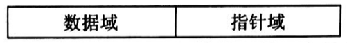

# 数据结构

> 关键词：逻辑结构、物理结构、存储结构、数据元素、结点

如果要对数据结构细化区别，会分为 **逻辑结构** 和 **物理结构**。

## 逻辑结构

数据结构的逻辑结构是对数据元素之间关系的描述，我们常说的数据结构其实是指逻辑结构。

逻辑结构有 4 种基本类型：**集合结构**、**线性结构**、**树状结构** 和 **网络结构**。

**集合结构**

集合结构是指数据元素松散的逻辑结构。例如：哈希表、集合、背包。

**线性结构**

线性结构是指数据元素间呈现线性关系的逻辑结构，即：数据元素一个接一个排列。例如：栈、队列、字符串。

**树状结构**

树状结构是指数据元素之间有严格的层次关系的逻辑结构，其中某个数据元素最多只和它上一层的一个数据元素有直接的关系，而与它下一层的多个数据元素有直接关系，顶层仅有一个称为根的数据元素。例如：树。

**网络结构**

任意两个数据元素间都可能有直接关系的逻辑结构。例如：图。

## 物理结构

数据结构的物理结构是指逻辑结构在计算机中的表示，物理结构也称存储结构。

在物理结构中，数据元素间的关系有两种不同的表示方法：顺序表示和非顺序表示，并由此得到两种不同的物理结构：**顺序存储结构** 和 **链式存储结构**。

**顺序存储结构**

顺序存储结构是指逻辑上相邻的数据元素存储在物理位置相邻的存储单元里的物理结构，因此数据元素间的逻辑关系不需要占用额外的存储空间，由如下所示的固定算法就可以随机访问任一个数据元素。通常在高级程序设计语言中使用 **数组** 来实现。

设 `L` 是每个数据元素所占存储空间的字节数、`LOC(a_1)` 表示第 `1` 个数据元素的存储位置，则第 `i` 个数据元素 `a_i` 的存储位置为：

$$
LOC(a_i)=LOC(a_1) + (i-1) * L
$$

所以，顺序存储结构的优点是可以随机访问任一个数据元素，缺点是插入和删除操作需要移动元素。在插入前要移动数据元素以挪出空的存储单元，然后再插入数据元素；删除时同样需要移动数据元素，以填充被删除的数据元素空出来的存储单元。

在 `n` 个数据元素中插入新数据元素时，共有 `n+1` 个插入位置，当在位置 `1` (数据元素 `a_1` 所在位置) 插入新数据元素，其中原有的 `n` 个数据元素都需要移动；当在位置 `n+1` (数据元素 `a_n` 所在位置之后) 插入新数据元素时不需要移动任何数据元素，因此，等概率下 (即新数据元素在 `n+1` 个位置插入的概率相同时) 插入一个新数据元素需要移动的数据元素个数期望值 `E_insert` 为：

$$
E_{insert} = \sum_{i=1}^{n+1}{P_i} * (n-i+1) = \frac{1}{n+1}\sum_{i=1}^{n+1}(n-i+1) = \frac{n}{2}
$$

其中，`P_i` 表示在位置 `i` 插入新数据元素的概率。

在 `n` 个数据元素中删除数据元素时，共有 `n` 个可删除的数据元素，删除数据元素 `a_1` 时需要移动 `n-1` 个数据元素，删除数据元素 `a_n` 时不需要移动数据元素，因此，在等概率下删除一个数据元素需要移动的数据元素个数期望值 `E_delete` 为：

$$
E_{delete} = \sum_{i=1}^{n}{q_i} * (n-i) = \frac{1}{n} * \sum_{i=1}^{n}{(n-i)} = \frac{n-1}{2}
$$

其中，`q_i` 表示删除第 `i` 个数据元素的概率。

**链式存储结构**

链式存储结构是指不要求逻辑上相邻的数据元素存储在物理位置上也相邻的存储单元里的物理结构，因此数据元素间的逻辑关系需要占用额外的存储空间。通常在高级程序设计语言中使用 **指针** 来实现。

链式存储结构是通过用指针链接起来的结点来存储数据元素，基本的结点结构如下所示：

其中，数据域用于存储数据元素，指针域则存储当前数据元素的直接前驱结点或直接后继结点的位置信息，指针域中的信息称为指针 (或链)。所以，在链式存储结构中，只需要一个指针 (称为头指针) 指向第一个结点，就可以顺序地访问到其中的任一个数据元素。

在 `n` 个结点中访问某一个数据元素时，共有 `n` 个可访问的结点，当在第一个结点访问到目标数据元素时，访问结点个数为 `1`；当在第 `n` 个结点访问到目标数据元素时，访问结点个数为 `n`，因此，等概率下访问某一个数据元素需要访问的结点个数期望值 `E_visit` 为：

$$
E_{visit} = \sum_{i=1}^{n}{P_i} * i = \frac{1}{n} * \sum_{i=1}^{n}{i} = \frac{n + 1}{2}
$$

其中，`P_i` 表示在第 `i` 个结点访问到目标数据元素的概率。

在链式存储结构下进行插入和删除，其实质都是对当前结点的直接前驱结点和直接后继结点的访问，然后对相关指针的修改。
