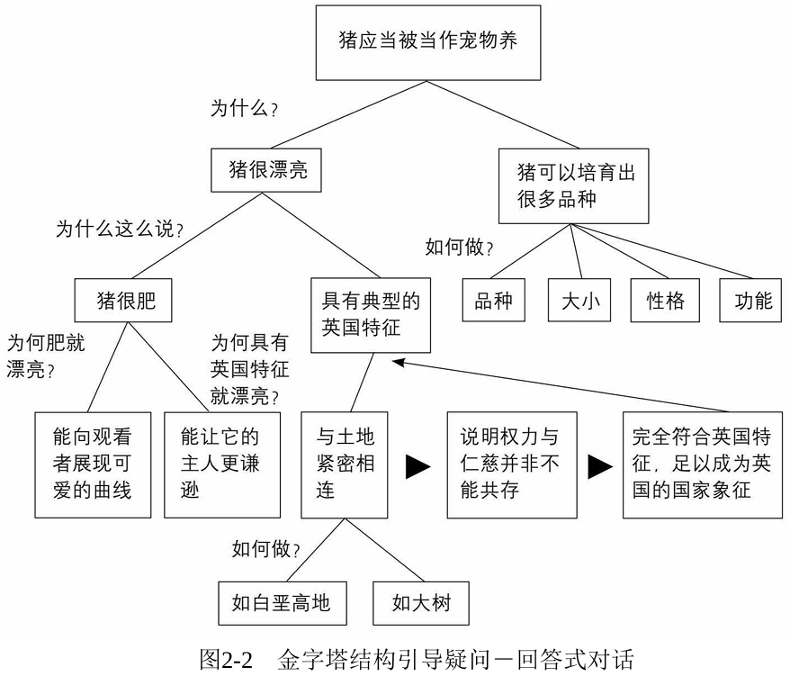

# 第 2 章 金字塔内部的结构

金字塔结构的规则非常明确：**如果在开始写作之前，你就已经清晰知道自己想要表达的思想，那么将其组织成规范的金字塔结构会相对容易。**

**然而，现实情况是，大多数人在开始写作时，往往对自己想表达的内容只有模糊的想法，甚至根本不知从何入手。** 因此，不要期望坐下来就能立刻构建出完美的金字塔。

**写作的第一步，必须是梳理想要表达的思想。而金字塔结构中的关键子结构，恰恰为这个梳理过程提供了强有力的框架，主要体现在以下三个方面：**

1. **主题与子主题之间的纵向关系：** 确保上层观点能自然引出下层支撑。
2. **各子主题之间的横向关系：** 保证同一层级的思想逻辑严谨、归类清晰（如演绎、归纳、时间顺序等）。
3. **序言的叙述逻辑：** 通过 "背景 - 冲突 - 疑问 - 答案" 的结构，有效引出核心主题并锁定受众注意力。

## 纵向关系

**纵向联系的核心作用在于持续吸引受众的注意力。** 它通过构建一种 **"疑问 - 回答" 式的对话**，引导受众跟随你的思路层层深入，激发其阅读兴趣。

在金字塔结构中，每一个方框代表一个 "思想"。本书将 "思想" 定义为：**"向受众传递新信息，并引发其疑问的语句"。**

当你向受众传递一个新信息（思想）时，自然会引发他们的疑问（如："为什么会这样？"、"怎么样才能这样？" 或 "为什么这样说？" 等）。**作为作者，你必须在下一层级上横向回答这个疑问。**

**然而，你的回答本身又会包含新的信息，这又会引发受众新的疑问。** 于是，你需要在更下一层级继续回应。**这个 "引发疑问 - 提供回答（新信息）- 再引发新疑问" 的循环会持续下去，直到你判断受众不再有疑问为止。**

图 2-2 摘录了 G.K.切斯特顿文章中的一个幽默故事。选择此例，是为了直观展示：**纵向的 "疑问 - 回答" 式对话如何有效抓住受众注意力，并让作者在构思时能暂时专注于纵向推进，而不过早纠结于横向逻辑的细节。**

> **切斯特顿主张：猪应当被当作宠物养。**
>
> 受众疑问："为什么？"
>
> 切斯特顿回答："有两个原因：猪很漂亮，且能培育出多种品种。"
>
> 受众追问："为什么说猪漂亮？"
>
> 切斯特顿："因其肥胖的体型和典型的英国特征。"
>
> 受众再问："肥胖的猪有何美感？"
>
> 切斯特顿："丰满的曲线赋予观赏性，同时提醒主人保持谦逊。"
>
> 受众继续："为何英国特征代表美？"
>
> 切斯特顿："猪与土地的紧密联结，象征权力与仁慈并非不能共存——这种精神极具英国特质，堪为国家象征。"

你或许不认同切斯特顿的观点，但**其论述的清晰性毋庸置疑**：

1. **每一层级的思想都精准回应了上一层级引发的疑问**；
2. **当某个分支的疑问被完全解答（如 "猪为何漂亮"）后，受众不再产生新疑问，作者自然转向下一分支（如 "品种多样性"）**。

**这种清晰性，正是源于所有思想严格遵循 "疑问 - 回答" 的纵向逻辑链**：每个新信息都主动预判并回应受众预期中的疑问。

综上所述，**金字塔结构的核心价值正在于此：**

- **它强制你将隐性的思维过程显性化**，通过纵向的 "疑问 - 回答" 链逐层展开逻辑；
- **你的每一个表述都应当引发受众的疑问**，并在下一层级通过横向排列的子观点精准回应；
- **循环此过程，直至受众再无疑问**——此时你的思想已无懈可击。

## 横向关系

**在构建金字塔的下一层级时，必须满足双重约束：**

1. **精准回应上层疑问**；
2. **严格遵循逻辑规则**——即所有子思想必须呈现纯粹的归纳或演绎关系，二者不可共存。

### 演绎逻辑：线性推理链

**演绎组由三个递进的思想构成：**

> 1. **普遍性前提**（对世界的客观陈述）
> 2. **特殊性前提**（对 1 的主语/谓语的针对性陈述）
> 3. **必然性结论**（由 1 + 2 推导出的隐含意义）
>
> 因此，演绎组应具有以下形式：
>
> - 所有人都会死。 （普遍性前提）
> - 苏格拉底是人。 （特殊性前提）
> - 苏格拉底会死。（必然性结论）

**当向更抽象层级（上一层级）概括时，主要是基于必然性结论**。如从 "苏格拉底会死" 可概括为 "人类生命有限"。

### 归纳逻辑：共性聚合

**归纳组的思想通过共性聚合，其特征是：**

> 所有思想可被**同一抽象概念**概括（如原因、步骤、问题类型等）。
>
> - 法国坦克抵波兰边境
> - 德国坦克抵波兰边境
> - 俄国坦克抵波兰边境

**当向更抽象层级（上一层级）概括时，主要是思想的共性聚合（如："三国军事力量在波兰边境集结"），并据此生成推论/概括（如：波兰面临坦克入侵威胁）。**

### 总结

| **逻辑类型** | **回应疑问的方式**     | **强制要求**                            |
| :----------- | :--------------------- | :-------------------------------------- |
| **演绎**     | 采用三段论             | 第二思想必须针对第一思想的主语/谓语展开 |
| **归纳**     | 聚合具有共同本质的思想 | 全组思想必须可被**同一抽象概念概括**    |

## 序言的结构

**写作的主要目的虽然是传递给他人未知的信息，但受众只会在产生认知需求时才会主动寻求答案。** 若受众未意识到信息缺口，便不会产生疑问，更不会关注你的内容。

**因此，吸引注意力的关键法则：** 文章必须回应受众既有的疑问，或激发其对现实问题的自发思考。**而序言正是通过 "叙述逻辑" 追溯问题的起源，构建这种认知连接。**

### 序言的黄金结构：SCQA 结构

序言应当采用经典叙述模式展开：

- **背景（Situation）**：明确时间/地点，建立受众熟悉的认知基础；
- **冲突（Complication）**：指出背景中发生的事件，打破现状平衡；
- **疑问（Question）**：冲突自然引发的关键问题（即：文章核心命题）；
- **回答（Answer）**：给出全文的顶层结论。

这种以讲故事式（叙述）的呈现方式，主要价值在于：

- **建立认知共识**：在展开逻辑前，使受众与作者站在同一起点；
- **前置思想焦点**：将核心结论置于金字塔顶端，符合 "结论先行" 原则。

### 序言对比：问题清单 vs SCQA 结构

为了说明以上观点，请看下面这段商业报告中的序言：

**原始版本（问题清单）：**

> 1. 董事会最合适的人数与构成；
> 2. 董事会与执委会的职责；
> 3. 独立董事的效能提升；
> 4. 董事会成员的选举和任期规则；
> 5. 董事会与执委会的运作方式优化。

**优化后版本（SCQA 结构）：**

> **背景**：10 月新设立的机构将获得管理该机构两个部门所有日常事务的全部权力和责任，这些权责以前由两个部门的经理负责。这一举措将使董事会从日常琐事中解脱出来，全力处理董事会独有的决策和规划等全局性事务。
>
> **冲突**：但是，因为董事会长期深陷于处理短期运营问题的状态，现在无法有效地将工作重心转移到长期战略发展上。
>
> **疑问**：如何实现工作重心转移？
>
> **回答**：董事会必须考虑实现工作重心转移所需要进行的变革。具体来说，应当考虑如下变革：
>
> 	1. 将日常运营事务交由执行委员会处理；
> 	1. 增加董事会编制，吸纳独立董事参与；
> 	1. 制定规范内部运作的政策和流程。

**总之，序言以讲故事的形式告诉受众，关于你正在讨论的主题他已经了解或将要了解的相关信息，从而引起受众的疑问，这个疑问也是整篇文章将要回答的问题。** 叙述式的序言说明了发生 "冲突" 的 "背景"，以及 "冲突" 引发的 "疑问"，而这个 "疑问" 正是文章将要 "回答" 的。一旦你提出了对该 "疑问" 的 "回答（即位于文章金字塔顶端的思想），就会使受众产生新的疑问，你就要在文章结构的下一层次回答这些新的疑问。

**这 3 种子结构（即纵向的疑问 - 回答式对话、横向的演绎或归纳推理、讲故事式的序言）能够帮助你找到构建金字塔结构所需的思想。**

| **子结构**          | **功能**               | **关键动作**                    |
| :------------------ | :--------------------- | :------------------------------ |
| **纵向疑问 - 回答** | 确定信息边界           | 每层思想必须回应上层疑问        |
| **横向演绎/归纳**   | 验证逻辑严谨性         | 严格选择演绎或归纳论证          |
| **序言 SCQA 结构**  | 确保内容与受众有相关性 | SCQA 结构连接受众认知与文章目标 |
