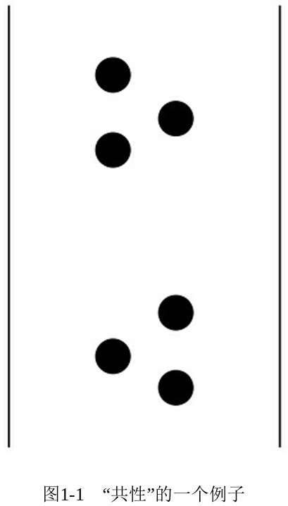
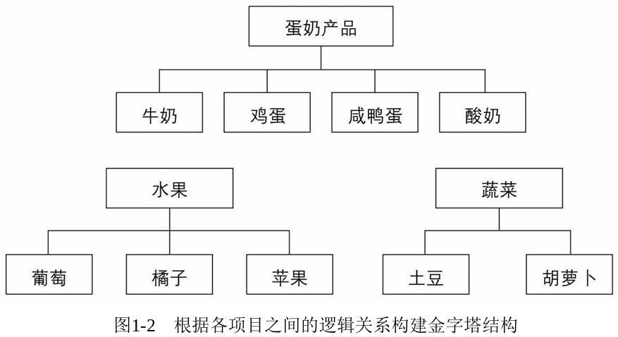
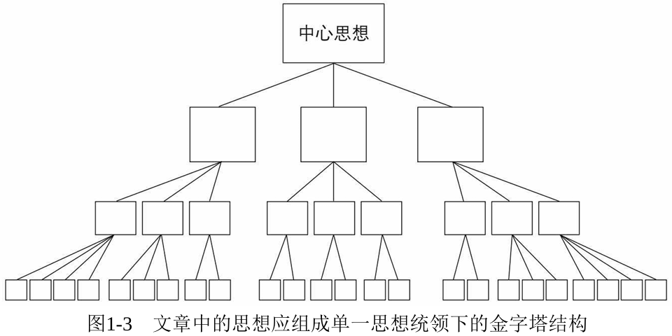

# 第 1 章 为什么要采用金字塔结构

当受众通过文本、演讲或培训等方式接收信息时，即使内容简短，也可能面临海量信息——他们需要理解每一句话并梳理之间的逻辑。采用金字塔结构组织内容（核心观点先行，自上而下展开）能显著降低理解难度，**这契合了人脑处理信息的根本规律：**

1. **自动归类：** 大脑本能地将信息归类整合，以辅助理解和记忆；
2. **偏好结构：** 经过预先结构化（金字塔结构）组织的信息更易于大脑处理；
3. **主动应用：** 因此，在任何表达场景（口头或书面）中，都应有意识地运用金字塔结构。

## 归类分组，构建金字塔式思维结构

人类从很早以前就认识到，大脑会自动将发现的所有事物按照某种秩序组织起来。**大脑在本质上会认为同时出现的事物之间存在某种关联，并且会将这些事物按某种逻辑模式组织起来。**

无论是谁，看到上图，都会认为有两组黑点，每组 3 个。造成这种印象的原因主要是：有些黑点间的距离比另一些黑点间的距离大。

**在接收信息时，大脑会将邻近的思想联系起来，努力用某种逻辑模式组织它们。这种逻辑模式就是金字塔结构**，因为只有金字塔结构才能满足大脑的两个需求：

1. 一次记忆不超过 7 个概念。
2. 找出逻辑关系。

为了说明金字塔结构的作用，请看以下采购清单。你可以尝试记住所有概念：

葡萄 鸡蛋 咸鸭蛋

牛奶 胡萝卜 苹果

土豆 橘子 酸奶

如果你试着去记住，你会发现，你已经根据各概念之间的逻辑关系建立了几个金字塔结构，如图 1-2 所示：

这样，你就无须再记忆其中的每个概念，而仅需要记忆 9 个概念分别所属的 3 个组。这样，思维抽象程度就提高了一层。**处于较高层次的思想总是能够提示其下面一个层次的思想。**

**所有的思维过程（如：思考、记忆、解决问题）显然都在使用这样的分组和概括的方法，将大脑中已有的无序信息组成一个由互相关联的金字塔构成的巨大的金字塔群。** 所以在与其他人沟通交流的过程中，你要做的就是确保自己所说的内容符合金字塔体系中的某一部分。

## 自上而下，结论先行

**清晰的表达必须遵循 "先结论后具体" 的顺序。** 首先提出核心结论或观点，再展开论述细节。否则，受众会自行归纳你零散表达的思想，可能误解其逻辑关系。

**由于受众的知识背景和理解力千差万别，若不预先阐明思想间的逻辑关系，极易导致其误读、漏读逻辑。**

想象一下，我们正在酒吧聊天，我说：

> 上周我在相对保守的苏黎世，仅在一家露天餐馆的 15 分钟内就见到了至少 15 位留长胡子的人。
>
> 在纽约，随便绕着哪栋写字楼走一圈，都能发现留长胡子或长头发的人。
>
> 当然，留长胡子早已是伦敦街头的常见景象。

你可能会想：**哦，她是想说伦敦更开放。** 这合乎逻辑，但却非我本意——我想说的是：**留长胡子在多个国际大都市都很常见，并非某个城市特有现象。**

如果我想准确传达这个观点，就应该**先说清我的结论**：

> 你知道吗？在大都市里，男人留长胡子或长头发已经如此普遍，如此被广泛接受，简直让我难以置信！
>
> 在苏黎世……
>
> 在纽约……
>
> 在伦敦……

你看，**关键就在于提前告知受众你组织信息的结构。** 因为他们接收信息时，本能地会寻找一种结构来串联信息。如果他们提前得知了结构，自然就能有效地引导他们理解你的思想。

**如果你不预先说明这个结构：**

- 受众可能会自行构建出错误的结构（如：认为我在比较开放度）。
- 受众可能无法自行构建出结构，无法理解信息间的逻辑关系，感到困惑。

这两种情况都意味着：你在浪费双方的时间。

**因此，务必在阐述细节前，先清晰地亮出你的结论。** 这能确保听众沿着你设定的路径理解信息。

**归根结底：如果你传达给受众的思想已事先进行了归类和概括，并且按 "自上而下" 的顺序呈现，受众就更容易理解。** 这种金字塔结构，正是构建清晰、高效交流的关键。

## 自下而上思考，总结概括

**如果你将所有的信息进行归类分组、抽象概括，并以自上而下的方式表达出来，那么你的文章结构会如图 1-3 所示。** 每个方框代表你希望表达的一个思想。

仔细回想一下写作时的实际思考过程就会发现，该过程是自下而上的：**你的思维从最底部的层次开始构建，将句子按照某种逻辑顺序组成段落，然后将几个段落组成章节，最后将章节组成完整的文章，而代表整篇文章的则是金字塔最顶端的中心思想。**

你需要不断归类和概括思想，直至无法继续。因此，每篇文章的结构必然只支撑一个中心思想（金字塔顶端）。所有下层思想都逐级具体化，并共同解释和支持这个中心思想。

**金字塔中的思想通过向上、向下、横向三种方式互相关联：**

- **向上关联：** 上一层次思想是对其下一组思想的**概括**。
- **向下关联：** 下一层次思想是对其上一层次思想的**解释和支持**。
- **横向关联：** 同一组内的思想**彼此关联**。

**构建清晰的金字塔结构需遵循三大规则：**

1. **纵向规则（概括性）：**
   - 任一层次的思想必须是其下一层次思想的**概括**。
   - 在思维与写作的主要活动中，就是将具体思想**抽象概括**为更高层次的思想。
2. **横向规则（同范畴）：**
   - 同一组中的思想必须属于**同一逻辑范畴**（如：可以将苹果和梨归属于同一逻辑范畴——水果）。
   - 提升抽象层次时，组内思想必须具有明确的**共同逻辑属性**（如：同为原因、步骤、问题等）。
3. **横向规则（逻辑顺序）：**
   - 同一组中的思想必须按**逻辑顺序**组织。
   - 组织思想的逻辑顺序主要有以下 4 种：
     - **演绎顺序：** 大前提、小前提、结论；
     - **时间（步骤）顺序：** 第一、第二、第三；
     - **结构（空间）顺序：** 部分 A、部分 B、部分 C；（如：北京、上海、深圳、广州）
     - **程度（重要性）顺序：** 最重要、次重要，等等。

**因此，清晰表达的关键在于：表达前将思想组织成符合以上规则的金字塔结构。** 任何规则不符都表明思路需调整，以避免后续的反复修改。
