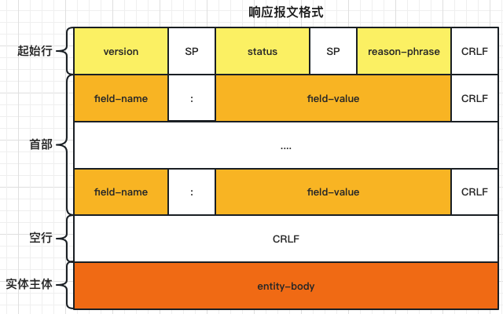

# HTTP 报文

HTTP 报文包括以下三个部分。

- 起始行

  报文的第一部分/行是起始行，在请求报文中用来说明要做些什么，而在响应报文中用来说明出现了什么情况。

- 首部

  报文的第二部分是首部，可以有零个或多个首部字段。每个首部字段都包含一个名字和一个值，为了便于解析，两者之间用冒号 (`:`) 来分隔，每个首部字段以一个空行 CRLF 结尾。首部和实体主体之间还会以一个空行 CRLF 分隔。

- 实体主体

  报文的第三部分是可选的实体主体，其中可以包含任意的二进制数据 (比如图片、视频、音轨、软件程序) 或文本。

**请求报文的格式：**

```
<method> <request-URL> <version>
<headers>
<entity-body>
```


**响应报文的格式：**

```
<version> <status> <reason-phrase>
<headers>
<entity-body>
```



## 起始行

:warning:请求报文和响应报文的格式并不完全一致，它们在起始行部分会有所不同。

### 请求起始行

```
<method> <request-URL> <version>
```

- `<method>` 客户端希望服务器对资源执行的动作。是一个单独的词，比如 GET、HEAD 或 POST。
- `<request-URL>` 请求资源的 URL。
- `<version>` 报文所使用的 HTTP 版本。

例如：`GET /index.html HTTP/1.1`

### 响应起始行

```
<version> <status> <reason-phrase>
```

- `<version>` 报文所使用的 HTTP 版本。
- `<status>` 用三位数字描述了请求过程中所发生的情况。
- `<reason-phrase>` 状态码的可读版本。

例如：`HTTP/1.1 200 OK`

## 首部

首部部分可以有零个或多个首部字段。HTTP 首部字段可以分为以下几类。

- 通用首部字段

  既可以出现在请求报文中，也可以出现在响应报文中。

- 请求首部字段

  提供更多有关请求的信息。

- 响应首部字段

  提供更多有关响应的信息。

- 实体首部字段

  用于应对实体主体部分的首部字段。比如，可以用 `Content-Type` 来说明实体主体部分的数据类型。

- 扩展首部字段

  非标准的首部字段，即还未添加到已批准的 HTTP 规范，一般由应用程序开发者约定创建。

### 通用首部字段

通用首部字段提供了与报文相关的最基本的信息。

**通用的信息性首部字段**

| 首部字段          | 描述                                                                                                                           |
| ----------------- | ------------------------------------------------------------------------------------------------------------------------------ |
| Connection        | 允许客户端和服务器指定与请求/响应连接有关的选项                                                                                |
| Date              | 提供日期和时间标志，说明报文是什么时间创建的                                                                                   |
| MIME-Version      | 给出了发送端使用的 MIME 版本                                                                                                   |
| Trailer           | 如果报文采用了分块传输编码 (chunked transfer encoding) 方式，就可以用这个首部字段列出位于报文拖挂 (trailer) 部分的首部字段集合 |
| Transfer-Encoding | 告知接收端为了保证报文的可靠传输，对报文采用了什么编码方式                                                                     |
| Update            | 给出了发送端可能想要 "升级" 使用的新版本或协议                                                                                 |
| Via               | 显示了报文经过的中间节点 (代理、网关)                                                                                          |

**通用缓存首部字段**

HTTP/1.0 引入了允许 HTTP 应用程序缓存对象本地副本的首部字段，这样就不需要总是直接从源端服务器获取了。

| 首部字段      | 描述                                         |
| ------------- | -------------------------------------------- |
| Cache-Control | 用于随报文传送缓存指示                       |
| Pragma        | 另一种随报文传送指示的方式，但并不专用于缓存 |

### 请求首部字段

只在请求报文中有意义的首部字段。用于说明是谁或什么在发送请求、请求源自何处，或者客户端的喜好及能力。服务器可以根据请求首部字段给出的客户端信息，试着为客户端提供更好的响应。

**请求的信息性首部字段**

| 首部字段   | 描述                                         |
| ---------- | -------------------------------------------- |
| Client-IP  | 提供了运行客户端的机器的 IP 地址             |
| From       | 提供了客户端用户的 E-mail 地址               |
| Host       | 给出了接收请求的服务器的主机名和端口号       |
| Referer    | 提供了包含当前请求 URI 的文档的 URL          |
| UA-Color   | 提供了客户端显示器的显示颜色有关的信息       |
| UA-CPU     | 给出了客户端 CPU 的类型或制造商              |
| UA-Disp    | 提供了与客户端显示器 (屏幕) 能力有关的信息   |
| UA-OS      | 给出了运行在客户端机器上的操作系统名称及版本 |
| UA-Pixels  | 提供了客户端显示器的像素信息                 |
| User-Agent | 将发起请求的应用程序名称告知服务器           |

**Accept 首部字段**

Accept 首部字段为客户端提供了一种将其喜好和能力告知服务器的方式。这样，服务器就可以根据这些额外信息，对要发送的内容做出更明智的决定。

| 首部字段        | 描述                               |
| --------------- | ---------------------------------- |
| Accept          | 告诉服务器能够发送哪些媒体类型     |
| Accept-Charset  | 告诉服务器能够发送哪些字符集       |
| Accept-Encoding | 告诉服务器能够发送哪些编码方式     |
| Accept-Language | 告诉服务器能够发送哪些语言         |
| TE              | 告诉服务器可以使用哪些扩展传输编码 |

**条件请求首部字段**

有时客户端希望为请求加上某些限制。比如，如果客户端已经有了一份文档副本，就希望只在服务器上的文档与客户端拥有的副本有所区别时，才请求服务器传输文档。

| 首部字段            | 描述                                                       |
| ------------------- | ---------------------------------------------------------- |
| Expect              | 允许客户端列出某请求所要求的服务器行为                     |
| If-Match            | 如果实体标记与文档当前的实体标记相匹配，就获取这份文档     |
| If-Modified-Since   | 除非在某个指定的日期之后资源被修改过，否则就限制这个请求   |
| If-None-Match       | 如果提供的实体标记与当前文档的实体标记不相符，就获取文档   |
| If-Range            | 允许对文档的某个范围进行条件请求                           |
| If-Unmodified-Since | 除非在某个指定日期之后资源没有被修改过，否则就限制这个请求 |
| Range               | 如果服务器支持范围请求，就请求资源的指定范围               |

**安全请求首部字段**

HTTP 本身就支持一种简单的机制，可以对请求进行质询/响应认证。

| 首部字段      | 描述                                                                             |
| ------------- | -------------------------------------------------------------------------------- |
| Authorization | 包含了客户端提供给服务器，以便对其自身进行认证的数据                             |
| Cookie        | 客户端用它向服务器传送一个令牌——它并不是真正的安全首部字段，但确实隐含了安全功能 |
| Cookie2       | 用来说明请求端支持的 cookie 版本                                                 |

**代理请求首部字段**

| 首部字段             | 描述                                                                                  |
| -------------------- | ------------------------------------------------------------------------------------- |
| Max-Forward          | 在通往源端服务器端路径上，将请求转发给其他代理或网关的最大次数——与 TRACE 方法一同使用 |
| Proxy- Authorization | 与 Authorization 首部字段相同，但这个首部字段是在与代理进行认证时使用的               |
| Proxy-Connection     | 与 Connection 首部字段相同，但这个首部字段是在与代理建立连接时使用的                  |

### 响应首部字段

响应报文有自己的响应首部字段集。响应首部字段为客户端提供了一些额外信息，比如谁在发送响应、响应者的功能，甚至与响应相关的一些特殊指令。这些首部字段有助于客户端处理响应，并在将来发起更好的请求。

**响应的信息性首部字段**

| 首部字段    | 描述                                             |
| ----------- | ------------------------------------------------ |
| Age         | (从最初创建开始) 响应持续时间                    |
| Public      | 服务器为其资源支持的请求方法列表                 |
| Retry-After | 如果资源不可用的话，在此日期或时间重试           |
| Server      | 服务器应用程序软件的名称和版本                   |
| Title       | 对 HTML 文档来说，就是 HTML 文档的源端给出的标题 |
| Warning     | 比原因短语中更详细一些的警告报文                 |

**协商首部字段**

如果资源有多种表示方式——比如，如果服务器上有某文档的法语和德语译稿，HTTP/1.1 可以为服务器和客户端提供对资源进行协商的能力。

| 首部字段      | 描述                                                                                                                                                   |
| ------------- | ------------------------------------------------------------------------------------------------------------------------------------------------------ |
| Accept-Ranges | 对此资源来说，服务器可接受的范围类型                                                                                                                   |
| Vary          | 服务器查看的其他首部字段的列表，可能会使响应发生变化；也就是说，这是一个首部字段列表，服务器会根据这些首部字段的内容挑选出最适合的资源版本发送给客户端 |

**安全响应首部字段**

我们已经看到过安全请求首部字段了，这里是 HTTP 的质询/响应认证机制的响应侧。

| 首部字段           | 描述                                                                                           |
| ------------------ | ---------------------------------------------------------------------------------------------- |
| Proxy-Authenticate | 来自代理的对客户端的质询列表                                                                   |
| Set-Cookie         | 不是真正的安全首部字段，但隐含有安全功能；可以在客户端设置一个令牌，以便服务器对客户端进行标识 |
| Set-Cookie2        | 与 Set-Cookie 类似，RFC 2965 Cookie 定义                                                       |
| WWW-Authenticate   | 来自服务器的对客户端的质询列表                                                                 |

### 实体首部字段

有很多首部字段可以用来描述 HTTP 报文的负荷。由于请求和响应报文中都可能包含实体部分，所以在这两种类型的报文中都可能出现这些首部字段。

**实体的信息性首部字段**

| 首部字段 | 描述                                                                                |
| -------- | ----------------------------------------------------------------------------------- |
| Allow    | 列出了可以对此实体执行的请求方法                                                    |
| Location | 告知客户端实体实际上位于何处；用于将接收端定向到资源的 (可能是新的) 位置 (URL) 上去 |

**内容首部字段**

内容首部字段提供了与实体内容有关的特定信息，说明了其类型、尺寸以及处理它所需的其他有用信息。比如，Web 浏览器可以通过查看返回的内容类型，得知如何显示对象。

| 首部字段         | 描述                                  |
| ---------------- | ------------------------------------- |
| Content-Base     | 解析主体中的相对 URL 时使用的基础 URL |
| Content-Encoding | 对主体执行的任意编码方式              |
| Content-Language | 理解主体时最适宜使用的自然语言        |
| Content-Length   | 主体的长度或尺寸                      |
| Content-Location | 资源实际所处的位置                    |
| Content-MD5      | 主体的 MD5 校验和                     |
| Content-Range    | 在整个资源中此实体表示的字节范围      |
| Content-Type     | 这个主体的对象类型                    |

**实体缓存首部字段**

通用的缓存首部字段说明了如何或什么时候进行缓存。实体缓存首部字段提供了与被缓存实体有关的信息——比如，验证已缓存的资源副本是否仍然有效所需的信息，以及更好地估计已缓存资源何时失效所需的线索。

| 首部字段      | 描述                                                   |
| ------------- | ------------------------------------------------------ |
| ETag          | 与此实体相关的实体标记                                 |
| Expires       | 实体不再有效，要从原始的源端再次获取此实体的日期和时间 |
| Last-Modified | 这个实体最后一次被修改的日期和时间                     |

## 实体主体

HTTP 报文的第三部分是可选的实体主体部分。实体主体是 HTTP 报文的负荷，也就是 HTTP 要传输的内容。

请求实体主体中包括了要发送给 Web 服务器的数据；响应实体主体中包括了要返回给客户端的数据。起始行和首部都是文本形式且都是结构化的，而实体主体则不同，其中可以包含任意的二进制数据 (比如图片、视频、音轨、软件程序) 或文本。
