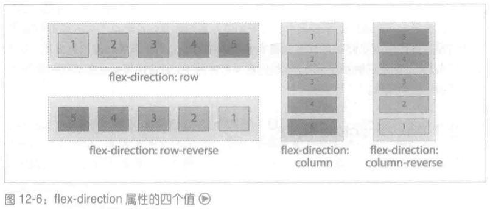
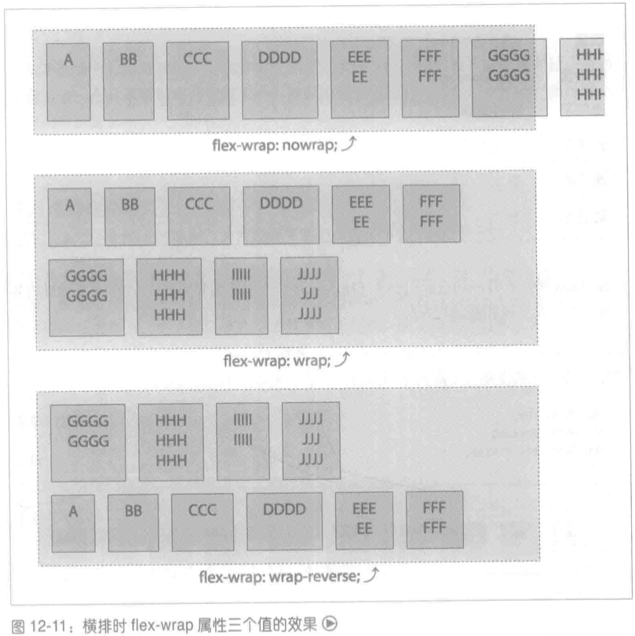
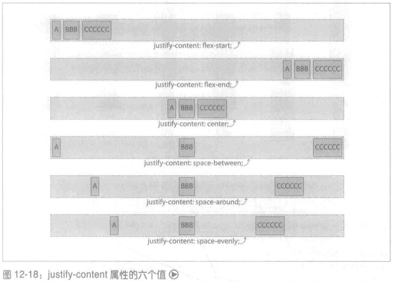
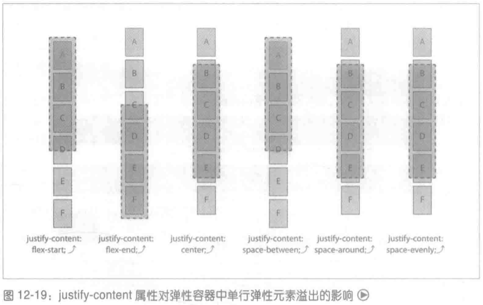
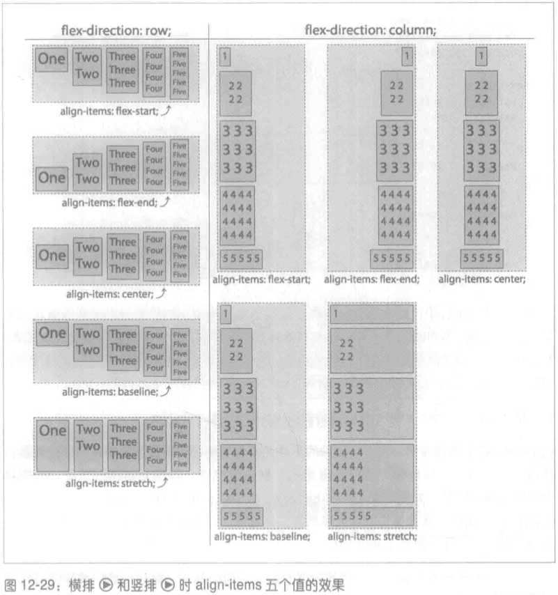
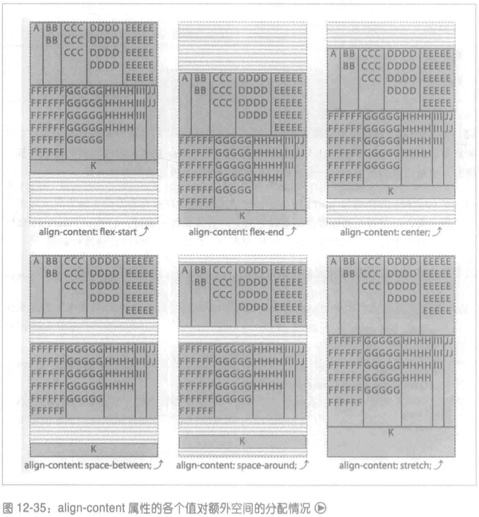
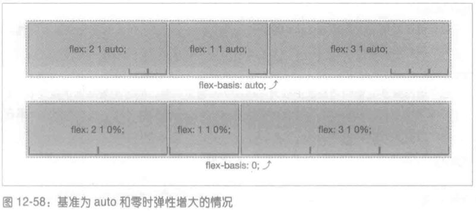

# 弹性盒布局

弹性盒依赖父子关系。在元素上声明 `display: flex` 或 `display: inline-flex` 便激活弹性盒布局，而这个元素随之成为弹性容器 (flex container)，负责在所占的空间内布置子元素，控制子元素的布局。弹性容器的子元素称为弹性元素 (flex item)。

弹性盒的目的是实现一种特定的布局，即一维内容分布。也就是说，弹性盒最适合沿一个方向 (或轴) 布置内容。虽然可以使用弹性盒实现栅格式的布局 (二维排列)，但这不是弹性盒的最初目的。如果你需要的是二维布局，建议使用 grid 栅格布局。

## 弹性容器

首先要完全理解的概念是弹性容器，也叫容器框。`display: flex` 或 `display: inline-flex` 声明的目标元素变成弹性容器，为其子元素生成弹性格式化上下文。

这些子元素不论是 DOM 节点、文本节点，还是生成的内容，都称为弹性元素。

### flex-direction 属性

如果你想要的布局是从上到下、从左至右、从右至左的，抑或是从下到上的，可以使用 flex-direction 属性控制排布弹性元素的主轴。

```
flex-direction
取值: row | row-reverse | column | column-reverse
初始值: row
适用于: 弹性容器
计算值: 指定的值
继承性: 否
动画性: 否
```

flex-direction 属性指定在弹性容器中如何摆放弹性元素，即定义弹性容器的主轴，弹性元素就沿这个轴排布。

以下述简单的标记为例：

```html
<ol>
  <li>1</li>
  <li>2</li>
  <li>3</li>
  <li>4</li>
  <li>5</li>
</ol>
```

假设语言的书写方向是从左至右，在这个简单的列表上分别应用 flex-direction 属性的四个值得到的结果如图 12-6 所示。



### flex-wrap 属性

如果弹性元素在弹性容器的主轴上放不下，默认情况下弹性元素不会换行，也不会自行调整尺寸。如果通过 flex 属性设定允许弹性元素缩减尺寸，那就缩减尺寸，否则，弹性元素将从容器框的边界溢出。

这个行为受我们的控制。我们可以在容器上设置 flex-wrap 属性，允许弹性元素换行，变成多行或多列，而不让弹性元素从容器中溢出，或者缩减尺寸，挤在同一行。

```
flex-wrap
取值: nowrap | wrap | wrap-reverse
初始值: nowrap
适用于: 弹性容器
计算值: 指定的值
继承性: 否
动画性: 否
```

flex-wrap 属性的作用是限制弹性容器只能显示一行，或者允许弹性元素在必要时显示多行。允许换行时，wrap 和 wrap-reverse 决定多出的行显示在第一行之前还是之后。

图 12-11 展示 flex-direction 的值为 row 时 (而且语言是从左至右书写的) flex-wrap 属性三个值的效果。图中的示例有两行弹性元素，可以看出，后续的行添加在垂轴上 (这里是纵轴)。



### flex-flow 属性

flex-flow 属性用于定义主轴和垂轴的方向，以及是否允许弹性元素换行。

```
flex-flow
取值: <flex-direction> | <flex-wrap>
初始值: row nowrap
适用于: 弹性容器
计算值: 指定的值
继承性: 否
动画性: 否
```

flex-flow 属性是 flex-direction 和 flex-wrap 两个属性的简写形式，用于定义弹性容器的换行方式及主轴和垂轴的方向。

### justify-content 属性

justify-content 属性指明在弹性容器的主轴上如何分布各行里的弹性元素。这个属性应用于弹性容器上，不能用到单个弹性元素上。

```
justify-content
取值: flex-start | flex-end | center | space-between | space-around | space-evenly
初始值: flex-start
适用于: 弹性容器
计算值: 指定的值
继承性: 否
动画性: 否
```

justify-content 属性定义如何把弹性容器的空间分配到弹性元素的四周或者弹性元素之间。六个可选值的效果如图 12-18 所示。



- flex-start：弹性元素紧靠主轴起边。
- flex-end：弹性元素紧靠主轴终边。
- center：把弹性元素作为一个整体，居中显示在主轴尺寸的中点。
- space-between 值把每一行里的第一个弹性元素放在主轴起边，把每一行里最后一个弹性元素放在主轴终边，然后在余下的每一对相邻的弹性元素之间放置等量的空白。
- space-around 把余下的空间拆分开，把各部分的一半分配给每个弹性元素，看起来就像每个元素四周都有等量的不折叠外边距。
- space-evenly 也把余下的空间拆分开，不过每个间距的长度是相等的。

justify-content 属性不仅影响一行中弹性元素的位置。如果禁止弹性元素换行，而且弹性元素将溢出，那么 justify-content 的值还影响弹性元素如何从弹性容器中溢出，如图 12-19 所示。



### align-items 属性

justify-content 定义弹性元素在弹性容器主轴方向上的对齐方式，而 align-items 属性定义的是弹性元素在垂轴方向上的对齐方式。与 justify-content 一样，align-items 应用在弹性容器上，而不能应用到单个弹性元素上。

```
align-items
取值: flex-start | flex-end | center | baseline | stretch
初始值: stretch
适用于: 弹性容器
计算值: 指定的值
继承性: 否
动画性: 否
```

使用 align-items 属性，可以把所有元素都向垂轴起边或终边靠拢，也可以拉伸元素，同时靠拢起边和终边。此外，还可以把所有弹性元素都居中显示在垂向上。这个属性有五个可选值，包括 flex-start、flex-end、center、baseline 和默认的 stretch，如图 12-29 所示。



- flex-start：值把弹性元素放在垂轴起边。
- flex-end：把弹性元素放在垂轴终边。
- center：把元素与垂轴的中点对齐。
- baseline：把弹性元素的基线与所在行中最低的基线对齐。
- stretch：拉伸弹性元素。

### align-content 属性

align-content 属性定义弹性容器有额外的空间时在垂轴方向上如何对齐各弹性元素行，以及空间不足以放下所有弹性元素行时从哪个方向溢出。

```
align-content
取值: flex-start | flex-end | center | space-between | space-around | space-evenly | stretch
初始值: stretch
适用于: 分为多行显示的弹性容器
计算值: 指定的值
继承性: 否
动画性: 否
```

align-content 的作用与 justify-content 类似，后者在弹性容器的主轴方向上对齐各个弹性元素，而前者在弹性容器的垂轴方向上对齐各弹性元素行。align-content 属性只适用于分为多行显示的弹性容器，对禁止换行及只有一行的弹性容器没有影响。

以下述 CSS 为例，假设弹性元素没有外边距：

```css
.flex-container {
  display: flex;
  flex-flow: row wrap;
  align-items: flex-start;
  border: 1px dashed;
  height: 480px;
  background-image: url(banded.svg);
}
.flex-items {
  margin: 0;
  flow: 1;
}
```

在上述 CSS 的基础上分别使用 align-content 属性的七个值，得到的结果如图 12-35 所示。每个示例中都有三个弹性元素行，各行在垂轴起边和垂轴终边一侧的边分别使用红线和蓝线表示，弹性容器中余下的空间，即弹性元素行之间或周围的空间以条纹区域表示。



## 弹性元素

### 弹性元素是什么

弹性容器的子代称为弹性元素。

对弹性容器中的文本子节点来说，如果文本节点不是空的 (内容不是空白)，将放在一个匿名弹性元素中，其行为与其他同辈弹性元素一样。虽然匿名弹性元素与同辈 DOM 节点一样，将继承在弹性容器上设置的相关弹性属性，但是不能直接使用 CSS 装饰。因此不能直接在匿名弹性元素上设置针对弹性元素的属性。所以，在下述标记中，两个元素 (`<strong>` 和 `<em>`) 及文本 "they're what's for" 都是弹性元素，共有三个弹性元素：

```html
<p style="display: flex;">
  <strong>Flex items:</strong> they're what's for <em>&lt;br&gt;fast!</em>
</p>
```

### 弹性元素的特征

弹性元素的外边距不折叠。float 和 clear 属性对弹性元素不起作用，不会把弹性元素移出文档流。其实，应用到弹性元素上的 float 和 clear 将被忽略 (然而，float 属性对框体的生成仍有影响，因为 display 属性的计算值受它影响)。来看下述代码：

```html
aside { display: flex; } img { float: left; }
<aside>
  <!-- 一条注释 -->
  <h1>Header</h1>

  
  Some text
</aside>
```

在这个示例中，aside 是弹性容器。注释和只有空白的文本节点被忽略。内容为 "Some text" 的文本节点将放在一个匿名弹性元素中。标题、图像和内容为 "Some text" 的文本节点都是弹性元素。因为图像是弹性元素，应用其上的 float 属性将被忽略。

此外，vertical-align 对弹性元素没有影响，只用于设定弹性元素中文本的对齐方式。也就是说，应用在弹性元素上的 `vertical-align: bottom` 将把弹性元素中的文本对齐到行框底部。但是不会把弹性元素推向所在容器的底部 (align-items 和 align-self 才有这样的效果)。

我们知道 float 不会浮动弹性元素，但是 `position: absolute` 则不一样。如果绝对定位弹性容器的子元素，与绝对定位普通元素一样，将从文档流中移除。除此之外，绝对定位的弹性元素不再参与弹性布局，因为它们已经不在文档流中。然而，这些元素将受应用在弹性容器上的样式影响，就像子元素受父元素 (非弹性容器) 的样式影响一样。

### flex 属性

弹性布局最突出的一点是能把弹性元素变得具有 "弹性"，即在主轴方向上调整弹性元素的宽度或高度，占满可用空间。弹性容器根据弹性增长因子 (flex grow factor) 按比例分配额外的空间，或者根据弹性缩减因子 (flex shrink factor) 按比例缩小弹性元素，以防溢出。

flex 属性它是 flex-grow、flex-shrink 和 flex-basis 的简写形式。虽然三个子属性可以单独使用，但是强烈建议始终使用简写的 flex。

```
flex
取值: [ <flex-grow> <flex-shrink>? || <flex-basis> ] | none
初始值: 0 1 auto
适用于: 弹性元素(弹性容器的子元素)
百分数: 只能作为 flex-basis 的值，相对父元素内的主轴尺寸计算
计算值: 参见各单独属性
继承性: 否
动画性: 参见各单独属性
```

flex 属性指定确定弹性长度的各要素。这里所说的 "长度" 是弹性元素在主轴方向上的长度。弹性元素所在的框体尺寸由 flex 决定，而不是确定主轴尺寸大小的属性 (height 或 width)。flex 属性的 "要素" 包括弹性增长因子、弹性缩减因子和弹性基准 (flex basis)。

弹性基准指明如何应用弹性增长因子和弹性缩减因子。flex-basis 这个名称表明，flex 简写属性的这个要素决定着，为了占满可用空间，弹性元素能增长多少，或者在空间不足时，弹性元素要缩减多少才能全部放得下。这是各弹性元素的初始尺寸，如果想限制尺寸不变，可以把增长和缩减因子都设为 0：

```css
.flexItem {
  width: 50%;
  flex: 0 0 200px;
}
```

在上述 CSS 中，弹性元素的主轴尺寸就是 200 像素，因为弹性基准的值是 200px。这个弹性元素既不能增大，也不能缩小。假设主轴是横向的，那么 width 的值 (50%) 将被忽略。类似地，如果主轴是纵向的，height 的值将被忽略。

### flex-grow 属性

flex 简写属性的 `<flex-grow>` 部分指定弹性增长因子。这个要素也可以通过 flex-grow 属性设定。

```
flex-grow
取值: <number>
初始值: 0
适用于: 弹性元素(弹性容器的子元素)
计算值: 指定的值
继承性: 否
动画性: 是
```

flex-grow 属性定义有多余的空间时是否允许弹性元素增大，以及允许增大且有多余的空间时，相对其他同辈弹性元素以什么比例增大。

flex-grow 的值始终是一个数字，负数无效。这个属性的值设定弹性增长因子，决定分配弹性容器的可用空间时相对其他同辈弹性元素能增大多少。如果弹性容器中有多余的空间，多出的空间将根据各弹性元素的非零增长因子按比例分配给各个弹性元素。

### flex-shrink 属性

flex 简写属性的 `<flex-shrink>` 要素指定弹性缩减因子。这个要素也可以通过 flex-shrink 属性设定。

```
flex-shrink
取值: <number>
初始值: 1
适用于: 弹性元素(弹性容器的子元素)
计算值: 指定的值
继承性: 否
动画性: 是
```

flex-shrink 属性定义空间不足以放下所有弹性元素时 (尺寸由内容或其他 CSS 属性定义)，当前弹性元素相对其他同辈弹性元素将缩小多少。如果在 flex 简写属性中没有声明，或者 flex 和 flex-shrink 都没有声明，缩减因子默认为 1。与增长因子一样，flex-shrink 的值始终为一个数字，而且负数无效。

### flex-basis 属性

flex 简写属性中的 `<flex-basis>` 要素指定弹性基准。这个要素也可以通过 flex-basis 属性设定。

```
flex-basis
取值: content | [ <length> | <percentage> ]
初始值: auto
适用于: 弹性元素(弹性容器的子元素)
百分数: 相对弹性容器内的主轴尺寸计算
计算值: 指定的值，长度值计算为绝对长度
继承性: 否
动画性: <width>
```

flex-basis 属性定义弹性元素的初始或默认尺寸，而且根据增长因子和缩减因子分配多余或缺少的空间之前，弹性元素的大小。

#### content 关键字

使用 content 时，弹性基准等于弹性元素中内容的尺寸，即最长一行内容或最宽 (或最高) 那个媒体对象在主轴上的长度。它相当于在弹性元素上声明 `flex-basis: auto; width: auto;` 或 `flex-basis: auto; height: auto;` (主轴为纵向时)。

#### auto 自动确定弹性基准

设为 auto 时，不管是显式声明还是取默认值，flex-basis 等于元素在主轴方向上的尺寸，就像没把元素变成弹性元素一样。如果 width 或 height 的值是长度，弹性基准就等于那个长度；而如果 width 或 height 也是 auto，那么弹性基准回落为 content。

#### 长度单位

弹性基准的值可以与 width 和 height 使用相同的长度单位。

如果既设定了 flex-basis，又设定了 width (或主轴为纵向时的 height)，弹性基准的优先级比宽度 (或高度) 高。

#### 百分比

flex-basis 的百分比值相对弹性容器的主轴尺寸计算。

#### 零基准

如果声明了 flex 属性，但是没有设定弹性基准要素，那么弹性基准默认为 0。

对 `flex-basis: auto` 来说，基准为弹性元素的内容在主轴方向上的尺寸。如果每个弹性元素的基准都是 0，那么 "可用" 空间将是整个弹性容器的主轴尺寸。两种情况下，"可用" 空间都根据各弹性元素的增长因子按比例分配。

基准为 0 时，弹性容器的尺寸根据增长因子按比例分给各个弹性元素。此时，由 height、width 或 content 定义的主轴方向上的原尺寸不在考虑范围内，然而 min-width、max-width、min-height 和 max-height 对弹性尺寸有一定的影响。

如图 12-58 所示，基准为 auto 时，只有多出的空间按比例分配给允许增大的弹性元素。还是假设 "`flex: X X auto`" 文本的宽度为 110 像素，那么在第一个例子中，多出的 210 像素要分为 6 份，每份 35 像素，因此弹性元素的宽度分别为 180、145 和 215 像素。

在第二个例子中，基准为 0，全部 540 像素的空间都用于分配。540 像素的空间分为 6 份，每份 90 像素。因此，弹性元素的宽度分别为 180、90 和 270 像素。中间一个弹性元素的宽度为 90 像素，而其中的内容比 110 像素窄，所以这个弹性元素中的内容不换行。



### flex 简写属性

常见的弹性值有四个，涵盖了最常需要的效果：

- flex: initial

  这个值根据 width 或 height 属性 (由主轴方向决定) 确定弹性元素的尺寸，而且允许缩小。

- flex: auto

  这个值也根据 width 或 height 属性确定弹性元素的尺寸，但是元素是完全弹性的，既可以缩小也可以增大。

- flex: none

  这个值还是据 width 和 height 属性确定弹性元素的尺寸，但是元素完全没有弹性，不能缩小也不能增大。

- flex: `<number>`

  这个值把弹性元素的增长因子设为 `<number>` 指定的值，同时把缩减因子设为 0，把基准也设为 0。这意味着，width 和 height 属性的值相当于最小尺寸，弹性元素在有多余的空间时将增大。

#### initial 值

initial 是 CSS 中的全局关键字，任何属性都能使用这个关键字表示属性的初始值，即规范定义的默认值。因此，下面两个声明是等效的：

```css
flex: initial;
flex: 0 1 auto;
```

#### auto 值

`flex: auto` 的效果与 `flex: initial` 类似，不过弹性元素的弹性变形是双向的：如果容器的空间放不下全部弹性元素，元素将缩小；如果有额外的空间，弹性元素将增大。主轴方向上的任何多余空间都将分给弹性元素。下面两个声明是等效的：

```css
flex: auto;
flex: 1 1 auto;
```

#### none 值

声明了 `flex: none` 的弹性元素不具有弹性。下面两个 CSS 声明是等效的：

```css
flex: none;
flex: 0 0 auto;
```

#### 数字值

如果 flex 属性只有一个值，而且是正数，那个值将用作增长因子，而缩减因子默认为 0，基准也默认为 0。下面两个 CSS 声明是等效的：

```css
flex: 3;
flex: 3 0 0;
```

此时，目标弹性元素具有弹性，即可以增大。而缩减因子是什么值都没有意义，因为弹性基准为 0，弹性元素只能从那个基准开始增大。

### align-self 属性

这个属性在单个弹性元素上覆盖 align-items 属性的值。

```
align-self
取值: auto | flex-start | flex-end | center | baseline | stretch
初始值: auto
适用于: 弹性元素
继承性: 否
百分数: 不适用
动画性: 否
```

初始值 auto，表示不覆盖 align-items 属性的值。

### order 属性

默认情况下，弹性元素的显示和排布顺序与在源码中的顺序一致。弹性元素和弹性元素行的顺序可以使用 `flex-direction` 属性反转，但是有时你可能需要更细致的重排方式。order 属性用于修改单个弹性元素的显示顺序。

```
order
取值: <integer>
初始值: 0
适用于: 弹性元素以及弹性容器中绝对定位的子元素
计算值: 指定的值
继承性: 否
动画性: 是
```

order 属性的值指定一个排序组，把目标弹性元素归在其中。在页面中绘制弹性元素时，order 属性为负数的弹性元素显示在采用默认值 0 的弹性元素前面，而 order 属性为正数的弹性元素显示在采用默认值 0 的弹性元素后面。虽然弹性元素的视觉顺序变了，但是在源码中的顺序没变。屏幕阅读器的阅读顺序和 Tab 键的索引顺序都由 HTML 源码顺序定义。

弹性容器以修改后的文档顺序排布内容，从最小的排序组开始往大的排序组显示。如果几个弹性元素的 order 属性值一样，那么它们属于同一个排序组。同一排序组中的元素按照出现在源码中的顺序显示，然后再按照排序组的序号从小到大显示。
