# 栅格布局

栅格依赖父子关系。在元素上声明 `display: grid` 或 `display: inline-grid` 便激活栅格布局，而这个元素随之成为栅格容器 (grid container)，负责在所占的空间内布置子元素，控制子元素的布局。栅格容器的子元素称为栅格元素 (grid item)。

## 栅格容器

首先要完全理解的概念是栅格容器，也叫容器框。`display: grid` 或 `display: inline-grid` 声明的目标元素变成栅格容器，为其子元素生成栅格格式化上下文 (grid formatting context)。

这些子元素不论是 DOM 节点、文本节点，还是生成的内容，都称为栅格元素。

### 基本的栅格术语

在使用栅格属性的过程中，可能会创建或引用栅格布局的多个核心组件，如图 13-5 所示。

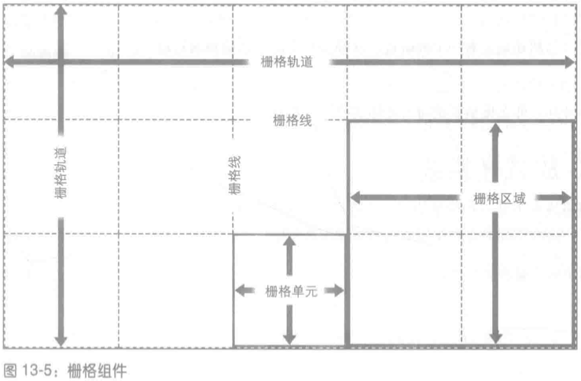

最重要的组件是栅格线。放置栅格线后，其他栅格组件也就随之而现了：

- 栅格轨道 (grid track) 指两条相邻的栅格线之间夹住的整个区域，从栅格容器的一边延伸到对边，即栅格列或栅格行。
- 栅格单元 (grid cell) 指四条栅格线限定的区域，内部没有其他栅格线贯穿，类似于单元格。这是栅格布局中区域的最小单元。
- 栅格区域 (grid area) 指任何四条栅格线限定的矩形区域，由一个或多个栅格单元构成最小的栅格区域是一个栅格单元，最大的栅格区域是栅格中所有的栅格单元。

### 放置栅格线

```
grid-template-rows, grid-template-columns
取值: none | <track-list>| <auto-track-list>
初始值: none
适用于: 栅格容器
百分数: grid-template-columns 的百分数值相对栅格容器的行内轴尺寸 (通常为宽度) 计算，grid-template-rows 的百分数值相对栅格容器的块级轴尺寸 (通常为高度) 计算
计算值: 声明的值，长度值计算为绝对长度
继承性: 否
动画性: 否
```

使用这两个属性可以大致定义栅格模板 (grid template) 中的栅格线。

#### 宽度固定的栅格轨道

这里所说的 "固定"，不单指固定的像素或 em 长度，百分数也算固定宽度。"宽度固定" 的栅格线指栅格线之间的距离不随栅格轨道中内容的变化而变。

下面举个例子。以下声明定义的是三个宽度固定的栅格栅格轨道：

```css
#grid {
  display: grid;
  grid-template-columns: 200px 50% 100px;
}
```

第一条栅格线在距栅格容器起边 (默认为左边) 200 像素的位置，第二条栅格线距第一条栅格线的距离为栅格容器宽度的一半，第三条栅格线距第二条栅格线 100 像素，如图 13-7 所示。

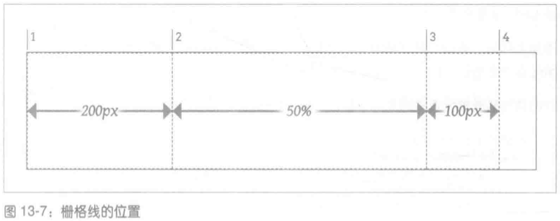

虽然第二列的尺寸会随栅格容器的尺寸变化，但是不会随这一列中栅格元素的内容而变。不管第二列中的内容多宽多窄，列的宽度始终为栅格容器宽度的一半。

此外，最后一条栅格线没有接触栅格容器的右边界。这没关系，没有规定必须接触。然而，如果你想让它们接触，稍后会介绍多种方法。

如果想为栅格线命名呢？只需把想用的名称放在值中的恰当位置，并在两侧加上方括号。名称的数量不限，想要多少个都可以。下面在前例的基础上为栅格线添加一些名称，结果如图 13-8 所示：

```css
#grid {
  display: grid;
  grid-template-columns: [start col-a] 200px [col-b] 50% [col-c] 100px [stop end last];
}
```

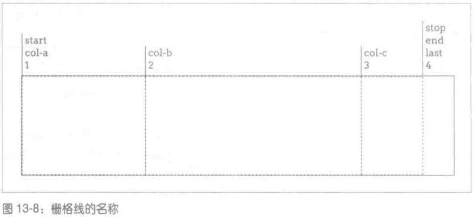

添加名称后，值的句法更清晰了：带数字的值设定的是栅格轨道的宽度，而栅格线两侧始终有个宽度值。因此，宽度值为 3 个时，得到的栅格线有 4 条。

行栅格线的放置方式与列完全一样，如图 13-9 所示：

```css
#grid {
  display: grid;
  grid-template-columns: [start col-a] 200px [col-b] 50% [col-c] 100px [stop end last];
  grid-template-rows: [start masthead] 3em [content] 80% [footer] 2em [stop end];
}
```

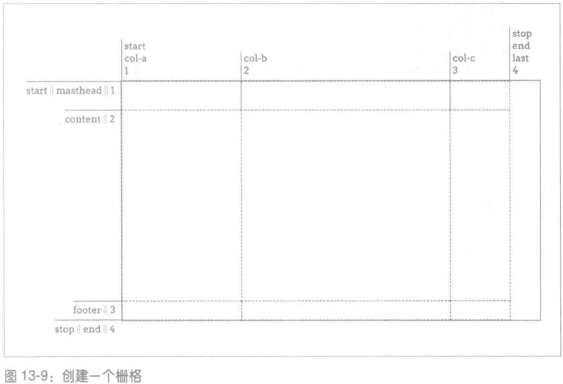

##### `minmax(min, max)`

栅格轨道的尺寸可以使用 `minmax(min, max)` 句法设定极值，指明栅格轨道不能小于一个值，也不能大于一个值，让浏览器计算具体的值。例如：

```css
#grid {
  display: grid;
  grid-template-columns: [start col-a] 200px [col-b] 50% [col-c] 100px [stop end last];
  grid-template-rows:
    [start masthead] 3em [content] minmax(3em, 100%)
    [footer] 2em [stop end];
}
```

注意，如果 minmax() 中指定的最大值比最小值小，最大值将被忽略，最小值将用于设定宽度固定的轨道长度。因此，`minmax(100px, 2em)` 在字号小于 50px 时将解析为 100px。

##### `calc()`

栅格轨道的尺寸还可以使用 calc() 计算。例如：

```css
grid-template-rows:
  [start masthead] 3em [content] calc(100% - 5em)
  [footer] 2em [stop end];
```

此时，content 和 footer 之间的栅格轨道的高度等于栅格容器的高度减去 5em。

#### 弹性的栅格轨道

目前所见的栅格轨道都不具有弹性，其尺寸由长度值或栅格容器的尺寸确定，不受其他因素的影响。与之相比，弹性的栅格轨道的尺寸基于弹性容器中非弹性轨道以外的空间确定，或者基于整个轨道中的具体内容而定。

##### 份数单位 fr

如果想把余下的空间分成一定份数，分配给各栏，可以使用 fr 份数单位。

例如，如果想要把整个容器平均分成四列，可以这样声明：

```css
grid-template-columns: 1fr 1fr 1fr 1fr;
```

它等效于：

```css
grid-template-columns: 25% 25% 25% 25%;
```

假如你想得到三列，中间一列的宽度为其他两列的两倍。那么，可以这样声明：

```css
grid-template-columns: 1fr 2fr 1fr;
```

在某些列的尺寸固定，而部分空间弹性伸缩时，份数单位特别有用。例如：

```css
grid-template-columns: 15em 1fr 10%;
```

这里，浏览器会为第一个和第三个轨道分配固定的宽度，而栅格容器中余下的空间，不管有多少，都分给中间那个轨道。

**fr 与 minmax()**

如果想确保第三列的宽度不小于 5em，可以把 CSS 声明改为：

```css
grid-template-columns: 15em 4.5fr minmax(5em, 3fr) 10%;
```

现在，布局的中间两列是弹性变形的，第三列的最小宽度为 5em。如果再变小，布局中将有三个宽度固定的列 (宽度分别为 15em、5em 和 10%)，以及一列尺寸弹性变化的列，其尺寸等于余下的空间 (如果有余的话)。如果超过这一宽度，布局中便会出现两个弹性变形的列。

注意，minmax() 表达式的最小值部分不允许使用 fr 单位。使用 fr 设定最小值将导致整个声明失效。

##### min-content 和 max-content

根据内容设定轨道的尺寸可以使用 min-content 和 max-content。

- max-content 的意思是 "占据内容所需的最大空间"。对大段文本来说 (例如博客文章)，这个值一般意味着尽量多占据可用空间，为内容提供最大的空间。max-content 也可以指 "宽度尽量大，以防换行"。对常规的文本段落而言，这可能导致列轨道特别宽。
- min-content 的意思是 "尽量少占据空间，够显示内容即可"。对文本来说，这意味着宽度会尽量收窄，只保证最长的单词 (如果有图像或表单输入框的话，指宽度最大的行内元素) 能在一行里完整显示。这个值会导致栅格元素中有大量断行，而且特别窄特别高。

这两个关键字的强大之处在于，它们将应用于整列/行栅格轨道上。例如，如果把一列的尺寸设为 max-content，那么整个列轨道的宽度都与列中最宽的内容一样。下面通过一个显示图像的栅格 (12 个) 说明这一点，栅格的声明如下，结果如图 13-16 所示：

```css
#gallery {
  display: grid;
  grid-template-columns: max-content max-content max-content max-content;
  grid-template-rows: max-content max-content max-content;
}
```

可以看到，每个列轨道的宽度都与轨道中最宽的图像相等，每个行轨道的高度都与轨道中最高的图像相等。

#### 内容适配的轨道

##### `fit-content()`

根据内容适配的轨道尺寸可以使用 fit-content()。

fit-content() 函数的参数为一个长度或一个百分数，规范给出的伪公式如下：

```
fit-content(argument) => min(max-content, max(min-content, argument))
```

这个公式的基本意思是，"先确定 min-content 和指定的参数哪个大，然后拿较大的那个值与 max-content 相比，找出较小的"。

其实 `fit-content(argument)` 等价于 `minmax(min-content, max-content)`，即在 argument 和 min-content 和 max-content 三者中取中间值。来看下面的例子：

```css
#example {
  display: grid;
  grid-template-columns: fit-content(50ch);
}
```

这里，参数的值为 50ch，即大约 50 个字符的宽度。

- 假设内容有 29 个字符长，相当于 29ch (由于用的是等宽字体)。此时，max-content 的值为 29ch，那么列的宽度就是 29ch，因为 max-content 比 50ch 小；比 min-content 大。
- 假设内容有 256 个字符长，相当于 256ch。此时，max-content 的计算结果为 256ch。这比参数指定的 50ch 大多了，因此列宽度的上限为 min-content 和 50ch 中较大的那个，即 50ch。

可以看出，使用 minmax() 的结果不太确定 (一般由浏览器计算的值)。使用 fit-content() 的结果相对确定，即在 argument 和 min-content 和 max-content 三者中取中间值。

#### 重复的轨道

##### `repeat()`

如果你想创建的栅格中各栅格轨道的尺寸是一样的，你可以不用一个一个输入尺寸值，可以使用 repeat()。

假设我们想每隔 5em 放置一条列栅格线，而且一共有 10 个列轨道。写法如下：

```css
#grid {
  display: grid;
  grid-template-columns: repeat(10, 5em);
}
```

就这样，我们创建了 10 个列轨道，每个轨道的宽度为 5em，共计 50em。

假设我们想定义的列结构为 2em-1fr-1fr，然后重复三次。写法如下：

```css
#grid {
  display: grid;
  grid-template-columns: repeat(3, 2em, 1fr, 1fr);
}
```

#### 自动填充的轨道

##### auto-fill

还有一种方法能重复简单的模式，直到填满整个栅格容器为止。

例如，假如我们想让前面的行模式一直重复，只要不撑破栅格容器即可：

```css
grid-template-rows: repeat(auto-fill, 5em);
```

因此，对 11em 高的栅格容器来说，等效于下述声明：

```css
grid-template-rows: 5em 5em;
```

auto-fill 至少会重复一次轨道模板，即使出于什么原因在栅格容器中放不下也是如此。

##### auto-fit

如果使用 auto-fit，没有栅格元素的轨道将被剔除。除此之外，auto-fit 的行为与 auto-fill 一样。对下述声明来说：

```css
grid-template-columns: repeat(auto-fit, 20em);
```

如果栅格容器中放得下 8 个列轨道，但是有 3 个轨道中没有栅格元素，那么这 3 个空的栅格轨道将被剔除，留下 5 个有栅格元素的列轨道。剔除轨道后留下的空间根据 align-content 和 justify-content 的值处理。图 13-25 对 auto-fill 和 auto-fit 做了简单的比较。

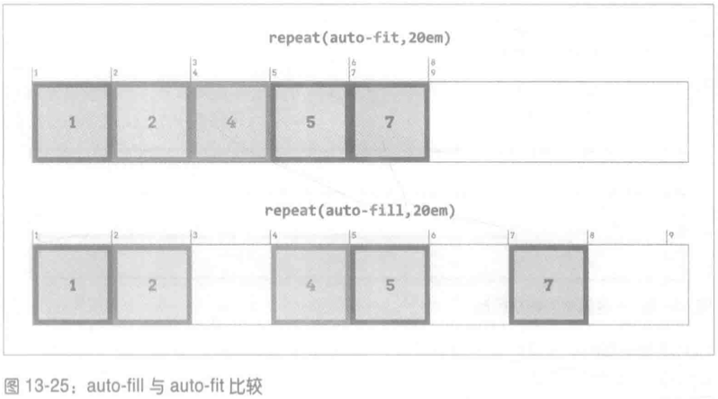

### 划分栅格区域

#### grid-template-areas 属性

使用 grid-template-areas 属性可以划分栅格区域。

```
grid-template-areas
取值: none | <string>
初始值: none
适用于: 栅格容器
计算值: 声明的值
继承性: 否
动画性: 否
```

下述规则得到的结果如图 13-26 所示：

```css
#grid {
  display: grid;
  grid-template-areas:
    "header header header header"
    "leftside content content rightside"
    "leftside footer footer footer";
}
```

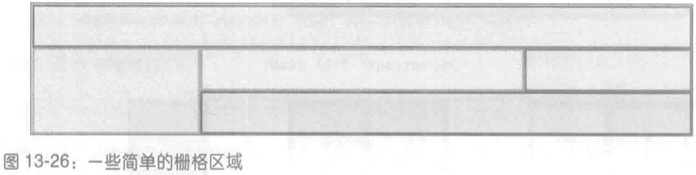

这个属性，`""` 引号定义的是栅格行，引号之内定义的是栅格列，栅格列之间或栅格行之间可以由空格或制表符隔开。

下述写法与上面例子的效果是一样的：

```css
grid-template-areas: "header header header header" "leftside content content rightside" "leftside footer footer footer";
```

如果只想把部分栅格单元定义为栅格区域的一部分，其他的单元不标注名称，可以使用一个或多个 `.` 字符占位。假如你只想定义页头、页脚和部分侧边栏区域，余下的栅格单元不命名。那么，可以像下面这样声明：

```css
#grid {
  display: grid;
  grid-template-areas:
    "header header header header"
    "left ... ... right"
    "footer footer footer footer";
}
```

上面定义的栅格，中间两个栅格单元不属于任何区域。

#### 栅格区域尺寸

定义好栅格区域之后，接下来要使用前面介绍的 grid-template-columns 和 grid-template-rows 定义栅格轨道的尺寸。下面把二者添加到前例中：

```css
#grid {
  display: grid;
  grid-template-areas:
    "header header header header"
    "left ... ... right"
    "footer footer footer footer";
  gird-template-columns: 1fr 20em 20em 1fr;
  grid-template-rows: 40px 10em 3em;
}
```

现在，具名栅格区域创建的列和行有轨道尺寸了。如果提供的轨道尺寸数量比区域轨道多，多出的轨道将放在具名区域之后。例如：

```css
#grid {
  display: grid;
  grid-template-areas:
    "header header header header"
    "left ... ... right"
    "footer footer footer footer";
  grid-template-columns: 1fr 20em 20em 1fr 1fr;
  grid-template-rows: 40px 10em 3em 20px;
}
```

上面的栅格容器，总共有 5 个栅格列，具名区域的列有 4 个。

## 在栅格中附加元素

附加栅格元素的方式有很多，可以引用栅格线，也可以引用栅格区域。

### 列线和行线

下面是把元素附加到栅格线上的四个属性。

```
grid-row-start, grid-row-end, grid-column-start, grid-column-end
取值: auto | <custom-ident> | [ <integer> && <custom-ident>? ] | [ span && [ <integer> || <custom-ident> ]]
初始值: auto
适用于: 栅格元素和绝对定位的元素 (前提是容纳块为栅格容器)
计算值: 声明的值
继承性: 否
动画性: 否
```

这几个属性的意思是，"我想把元素的边界附加到某条栅格线上。"下述 CSS 得到的结果如图 13-33 所示：

```css
.grid {
  display: grid;
  width: 50em;
  grid-template-rows: repeat(5, 5em);
  grid-template-columns: repeat(10, 5em);
}
.one {
  grid-row-start: 2;
  grid-row-end: 4;
  grid-column-start: 2;
  grid-column-end: 4;
}
.two {
  grid-row-start: 1;
  grid-row-end: 3;
  grid-column-start: 5;
  grid-column-end: 10;
}
.three {
  grid-row-start: 4;
  grid-column-start: 6;
}
```

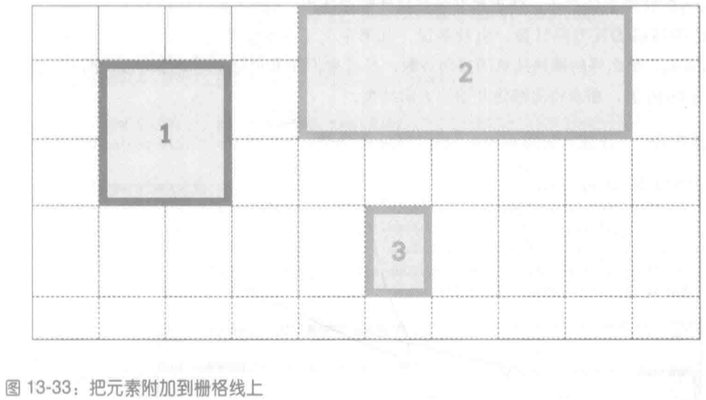

这里，我们通过栅格线的编号指明元素应该放在栅格中的什么位置，列的编号从左到右依次增加，行的编号从上到下依次增加。注意，如果省略结束栅格线，例如，`.three` 那样，那么结束栅格线使用序列中的下一条栅格线。

#### span

此外，还可以使用 span，后跟正整数或栅格线名称。如果 span 后面没有数字，默认为 1。

span 的特殊之处在于，结束和开始栅格线都能使用。span 的具体行为是，向确定了编号的栅格线的反方向计数。也就是说，如果定义了开始栅格线，而把结束栅格线设为 span 值，那么将向栅格结束的方向计数。反过来，如果定义了结束栅格线，而开始栅格线是 span 值，那么将向栅格开始的方向计数。

span 后面的数字，意思是 "跨指定数目的栅格轨道"。因此，前面的示例可以改为下面这样，得到的结果也是完全一样的：

```css
#grid {
  display: grid;
  grid-template-rows: repeat(5, 5em);
  grid-template-columns: repeat(10, 5em);
}
.one {
  grid-row-start: 2;
  grid-row-end: span 2;
  grid-column-start: 2;
  grid-column-end: span 2;
}
.two {
  grid-row-start: 1;
  grid-row-end: span 2;
  grid-column-start: 5;
  grid-column-end: span 5;
}
.three {
  grid-row-start: 4;
  grid-row-end: span 1;
  grid-column-start: 6;
  grid-column-end: span;
}
```

### 列线和行线的简写属性

下面是把元素附加到栅格线上的两个属性 (列线和行线的简写属性)。

```
grid-row, grid-column
取值: <grid-line> [/ <grid-line> ]?
初始值: auto
适用于: 栅格元素和绝对定位的元素 (前提是容纳块为栅格容器)
计算值: 声明的值
继承性: 否
动画性: 否
```

在以斜线分隔的两部分中，前一部分定义的是开始栅格线，后一部分定义的是结束栅格线。

### 栅格区域

通过行线和列线附加元素是不错，但是能不能只用一个属性引用栅格区域呢？当然可以。

```
grid-area
取值: <grid-line> [/ <grid-line> ]{0,3}
初始值: 参见各单独属性
适用于: 栅格元素和绝对定位的元素 (前提是容纳块为栅格容器)
计算值: 声明的值
继承性: 否
动画性: 否
```

把元素指定给定义好的栅格区域。把前文用过的 grid-template-areas 什么拿过来，加上 grid-area 声明和一些标记，得到的结果如图 13-40 所示：

```css
#grid {
    display: grid;
    grid-template-areas:
        "header header header header"
        "leftside content content rightside"
        "leftside footer footer footer";
}
#masthead {grid-area: header;}
#sidebar {grid-area: leftside;}
#main {grid-area: content;}
#navbar {grid-area: rightside;}
#footer {grid-area: footer;}

<div>
	<div id="masthead">...</div>
	<div id="main">...</div>
	<div id="navbar">...</div>
	<div id="sidebar">...</div>
	<div id="footer">...</div>
</div>
```

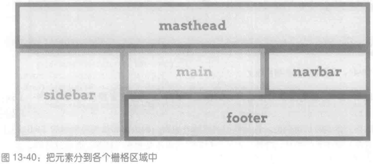

就是这么简单：先设置一些具名栅格区域，定义布局，然后通过 grid-area 把栅格元素放入指定的区域。简单而强大。

## 栅格流

栅格流主要分为两种模式，即行优先和列优先，不过二者都可以通过密集流 (denseflow) 增强。栅格流通过 grid-auto-flow 属性设置。

```
grid-auto-flow
取值: [ row | column ] || dense
初始值: row
适用于: 栅格容器
计算值: 声明的值
继承性: 否
动画性: 否
```

以下述标记为例说明这些值的作用：

```html
<ol id="grid">
  <li>1</li>
  <li>2</li>
  <li>3</li>
  <li>4</li>
  <li>5</li>
</ol>
```

我们在这段标记上应用下述样式：

```css
#grid {
  display: grid;
  width: 45em;
  height: 8em;
  grid-auto-flow: row;
}
#grid li {
  grid-row: auto;
  grid-column: auto;
}
```

假设栅格中每隔 15em 有一条列线、每隔 4em 有一条行线，那么将得到如图 13-44 所示的结果。

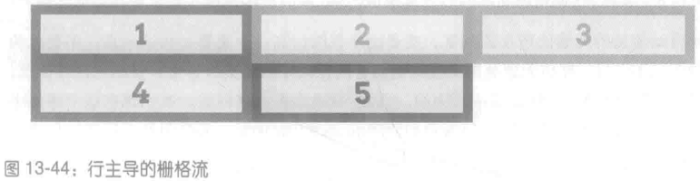

下面把 grid-auto-flow 的值换成 column 试试，结果如图 13-45 所示：

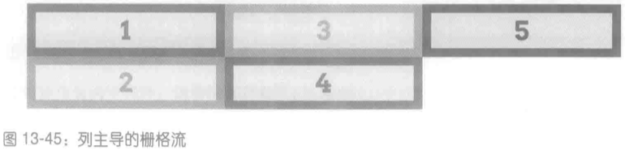

可以看到，声明 `grid-auto-flow: row` 时，先填满一行再转到下一行，而声明 `grid-auto-flow: column` 时，则先填满一列。

## 自动增加栅格线

目前我们见到的栅格元素基本上都是放在显式定义的栅格中。不过，栅格元素超出边界了怎么办呢？

```
grid-auto-rows, grid-auto-columns
取值: <track-breadth> | minmax( <track-breadth>, <track-breadth>)
初始值: auto
适用于: 栅格容器
计算值: 取决于具体的轨道尺寸
备注: <track-breadth> 代表 <length> | <percentage> | <flex> | min-content | max-content | auto
继承性: 否
动画性: 否
```

这两个属性设定自动创建的行或列轨道的尺寸时，可以提供一个尺寸值，也可以提供一对极值。下面设置一个 2 \* 2 栅格，但是在里面放 5 个元素。一次声明 grid-auto-rows，一次不声明，结果如图 13-51 所示：

```css
.grid {
  display: grid;
  grid-template-rows: 80px 80px;
  grid-template-columns: 80px 80px;
}
#g1 {
  grid-auto-rows: 80px;
}
```

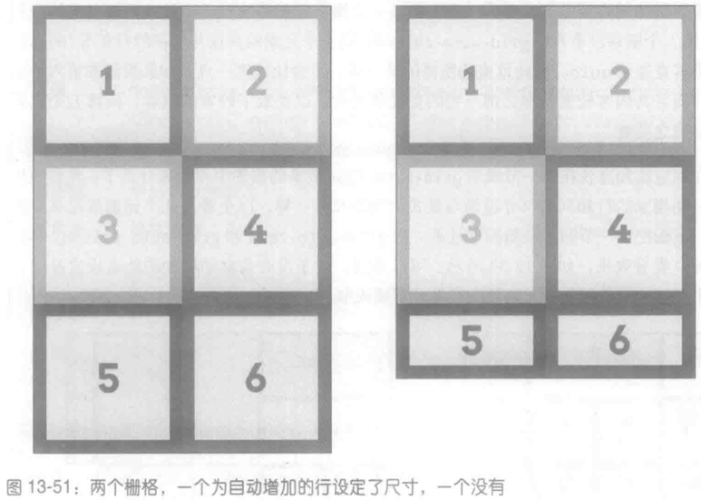

可以看到，不为自动创建的行设定尺寸时，多出的栅格元素所在的行将与栅格元素中的内容一样高，一像素也不多。但是宽度与所在的列相等，因为我们设定了列的宽度 (80px)。由于行没有显式设定高度，默认为 auto，因此得到图中所示的结果。

换成栅格流是列主导后，基本原理不变 (见图 13-52) ：

```css
.grid {
  display: grid;
  grid-auto-flow: column;
  grid-template-rows: 80px 80px;
  grid-template-columns: 80px 80px;
}
#g1 {
  grid-auto-columns: 80px;
}
```

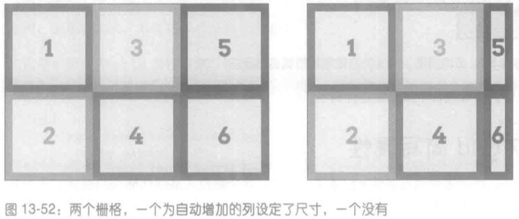

## grid 简写属性

```
grid
取值: none | subgrid |[ <grid-template-rows>/<grid-template-columns> ]|[ <line-names>? <string> <track-size>? <line-names>? ] + [/ <track-list> ]? | [ <grid-auto-flow> [ <grid-auto-rows> [/ <grid-auto-columns> ]? ]? ]]
初始值: 参见各单独属性
适用于: 栅格容器
计算值: 参见各单独属性
继承性: 否
动画性: 否
```

grid 属性的作用是以简洁的句法定义栅格模板，或者设定栅格流，并为自动增加的轨道设定尺寸。但是二者不能同时设置。未定义的值都重置为默认值，这与其他简写属性是一致的。

举个例子，下述 grid 声明与后面的几个规则是等效的：

```css
grid:
  "header header header header" 3em
  ". content sidebar ." 1fr
  "footer footer footer footer" 5em /
  2em 3fr minmax(10em, 1fr) 2em;

grid-template-areas:
  "header header header header"
  ". content sidebar ."
  "footer footer footer footer";
grid-template-rows: 3em 1fr 5em;
grid-template-columns: 2em 3fr minmax(10em, 1fr) 2em;
```

注意，grid-template-rows 的值被拆开了，与 grid-template-areas 的字符串放在一起。

grid 属性的另一个用法是融合 grid-auto-flow、grid-auto-rows 和 grid-auto-columns。下面两个规则是等效的：

```css
#layout {
  grid-auto-flow: dense rows;
  grid-auto-rows: 2em;
  grid-auto-columns: minmax(1em, 3em);
}

#layout {
  grid: dense rows 2em / minmax(1em, 3em);
}
```

## 释放栅格空间

### 栏距

拦距 (gutter) 是两个栅格轨道之间的间隔，好似把轨道之间的栅格线加粗，让它具有一定的宽度。栏距与表格样式中的 border-spacing 很像，一方面，栏距能在栅格单元之间添加间隔，另一方面，一个轴上只能设定一个间隔值。栏距使用 grid-row-gap 和 grid-column-gap 属性设定。

grid-row-gap 和 grid-column-gap 这两个属性现已改名为 row-gap 和 column-gap。

```
grid-row-gap, grid-column-gap
取值: <length> | <percentage>
初始值: 0
适用于: 栅格容器
计算值: 一个绝对长度
继承性: 否
动画性: 是
```

注意，取值句法表明，这两个属性的值只能是一个长度。这个长度必须为非负数。百分数、份数 (fr) 或极值是无效的。如果想让列之间有 1em 的间隔，声明 `grid-column-gap: 1em` 即可。结果显而易见，栅格中的每一列都将向后移 1em，如图 13-56 所示。

```css
#grid {
  display: grid;
  grid-template-rows: 5em 5em;
  grid-template-columns: 15% 1fr 1fr;
  grid-column-gap: 1em;
}
```

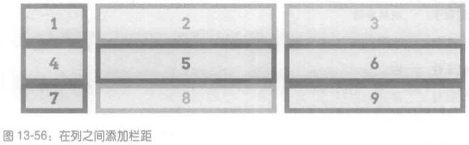

在设定栅格轨道的尺寸时，栏距被视作栅格轨道。因此，在下面的样式中，以份数设定的栅格行，其高度为 140 ((500px - 100px - 75px - 15px \* 3) / 2) 像素：

```css
#grid {
  display: grid;
  height: 500px;
  grid-template-rows: 100px 1fr 1fr 75px;
  grid-row-gap: 15px;
}
```

### grid-gap 属性

这个属性是 grid-row-gap 和 grid-column-gap 的简写属性。

grid-gap 这个属性已改名为 gap。

```
grid-gap
取值: <grid-row-gap> <grid-column-gap>
初始值: 0 0
适用于: 栅格容器
计算值: 声明的值
继承性: 否
动画性: 是
```

提供两个非负长度，分别定义行栏距和列栏距。例如：

```css
#grid {
  display: grid;
  grid-template-rows: 5em 5em;
  grid-template-columns: 15% 1fr 1fr;
  grid-gap: 12px 2em;
}
```

### 栅格元素与和盒模型

如果为附加到栅格中的元素添加其他样式，例如外边距，情况如何呢？如果是绝对定位呢？这些样式对栅格有何影响呢？

**外边距**

先看外边距。基本原理是，元素在外边距的边界处附加到栅格中。这意味着，设为正外边距时，元素的可见部分将在所处的栅格区域中向内收缩，而设为负外边距时，可见部分将向外扩张。例如，下述样式将得到如图 13-58 所示的结果：

```css
#grid {
  display: grid;
  grid-template-rows: repeat(2, 100px);
  grid-template-columns: repeat(2, 200px);
}
.box02 {
  margin: 25px;
}
.box03 {
  margin: -25px 0;
}
```

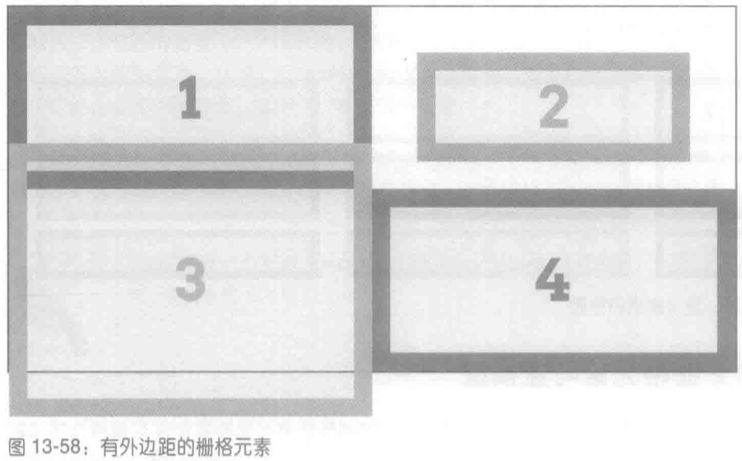

之所以显示为图中那样，是因为 width 和 height 的值都是 auto，所以元素可以根据需要自由伸缩。如果 width 和 / 或 height 的值不是 auto，那么为了满足算式，外边距的值将被覆盖。这与元素的尺寸过约束时左右外边距中有一个会被覆盖基本上是一个道理。

**绝对定位**

如果栅格元素绝对定位呢？例如：

```css
.exel {
  grid-row: 2 / 4;
  grid-column: 2 / 5;
  position: absolute;
  top: 1em;
  bottom: 15%;
  left: 35px;
  right: 1rem;
}
```

答案简洁明了，开始栅格线和结束栅格线围成的栅格区域用作容纳块和定位上下文，栅格元素就在这个上下文中定位。这意味着，偏移属性 (top 等) 都相对所在的栅格区域计算。因此，上述 CSS 将得到如图 13-61 所示的结果。

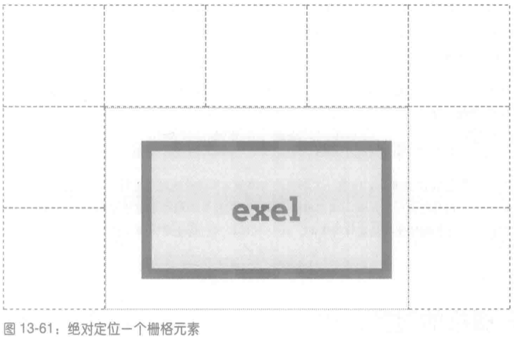

与绝对定位相关的各个方面，包括偏移、外边距、元素的尺寸等，都在这个格式化上下文中处理。只不过，格式化上下文现在是由栅格区域定义的。

## 栅格的对齐方式

学过弹性盒之后我们知道，弹性盒有多个用于对齐的属性和值。这些属性在栅格布局中也能使用，而且作用十分相像。

| 属性            | 对齐的目标                       | 适用于   |
| --------------- | -------------------------------- | -------- |
| justify-self    | 行内方向（横向）上的一个栅格元素 | 栅格元素 |
| justify-items   | 行内方向（横向）上的全部栅格元素 | 栅格容器 |
| justify-content | 行内方向（横向）上的整个栅格     | 栅格容器 |
| align-self      | 块级方向（纵向）上的一个栅格元素 | 栅格元素 |
| align-items     | 块级方向（纵向）上的全部栅格元素 | 栅格容器 |
| align-content   | 块级方向（纵向）上的整个栅格     | 栅格容器 |

### 纵向对齐和横向对齐单个元素

`*-self` 属性最简单，见图 13-63。

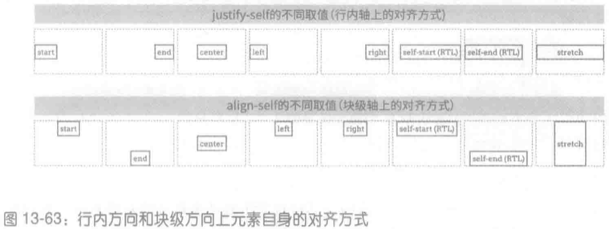

首先要明确的一点是，不管使用哪个值，只要没有显式设定 width 或 height，元素的内容将自动 "收缩"，而不是像默认行为那样，占满整个栅格区域。

- start：使栅格元素向栅格区域的起边对齐。
- end：使栅格元素向栅格区域的终边对齐。
- center：在对齐的轴上居中显示栅格元素。
- left：横向上，使栅格元素向栅格区域的左边对齐；纵向上，left 和 right 没有实际意义，因此将当做 start 处理。
- right：横向上，使栅格元素向栅格区域的右边对齐；纵向上，left 和 right 没有实际意义，因此将当做 start 处理。
- self-start：把栅格元素向起边那一侧的栅格区域的边界对齐。
- self-end：把栅格元素向终边那一侧的栅格区域的边界对齐。
- stretch：在指定的方向上拉伸元素。

### 纵向对齐和横向对齐全部元素

`*-items` 属性的取值与 `*-self` 一样，而且作用也相同，只不过应用的对象是栅格容器中的全部栅格元素，而且必须应用到栅格容器上，而不能应用到单个栅格元素上。

### 纵向对齐和横向对齐整个栅格

`*-content` 属性以横向对齐或纵向对齐整个栅格。图 13-65 展示了可用于 justify-content 属性的各个值的效果，各栅格共用的样式如下：

```css
.grid {
  display: grid;
  padding: 0.5em;
  margin: 0.5em 1em;
  width: auto;
  grid-gap: 0.75em 0.5em;
  border: 1px solid;
  grid-template-rows: 4em;
  grid-template-columns: repeat(5, 6em);
}
```

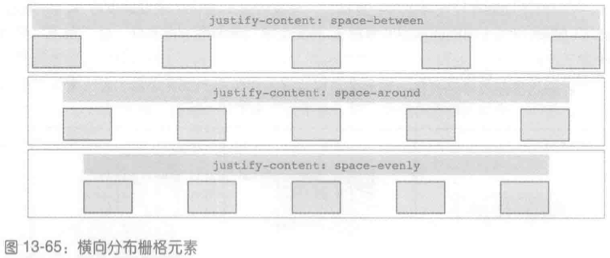

分布栅格元素时，栅格轨道 (包括栏距) 的尺寸还像往常一样处理。如果栅格容器中的空间有余，即栅格轨道没有从栅格容器的一边延伸到对边，那么余下的空间将根据 justify-content (横向) 或 align-content (纵向) 的值分配。

分配多出的空间其实就是调整栅格栏距的尺寸。如果没有声明栏距，那么分配的空间将成为栏距。如果声明了栏距，其尺寸将根据分配的情况而调整。

最后，我们来看一下对齐栅格轨道。图 13-67 是栅格轨道横向对齐的不同方式。

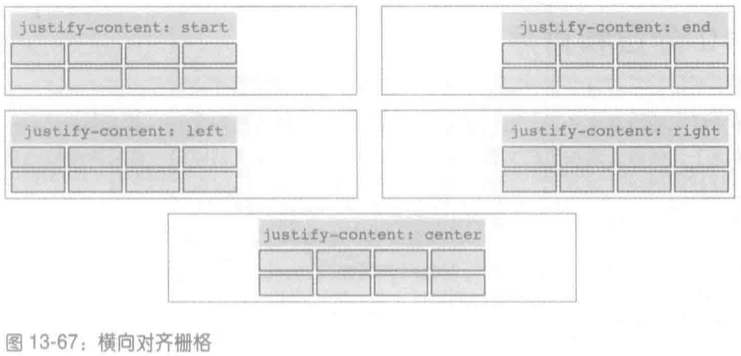

在纵向上 (align-content) 同理，只是 left 和 right 没有实际意义，因此将当做 start 处理。

## 分层和排序

栅格元素之间完全有可能重叠，原因可能是使用负外边距把栅格元素拉到栅格区域的边界之外了，也可能是两个栅格元素的栅格区域在同一个栅格单元中。默认情况下，栅格元素按照在文档源码中的顺序叠放，即在文档源码中靠后的栅格元素像是在靠前的栅格元素前面。因此，下述样式将得到如图 13-69 所示的结果 (假设类名中的数字表示各栅格元素在文档源码中的顺序)。

```css
#grid {
  display: grid;
  width: 80%;
  height: 20em;
  grid-rows: repeat(10, 1fr);
  grid-columns: repeat(10, 1fr);
}
.box01 {
  grid-row: 1 / span 4;
  grid-column: 1 / span 4;
}
.box02 {
  grid-row: 4 / span 4;
  grid-column: 4 / span 4;
}
.box03 {
  grid-row: 7 / span 4;
  grid-column: 7 / span 4;
}
.box04 {
  grid-row: 8 / span 7;
  grid-column: 3 / span 2;
}
.box05 {
  grid-row: 2 / span 3;
  grid-column: 4 / span 5;
}
```

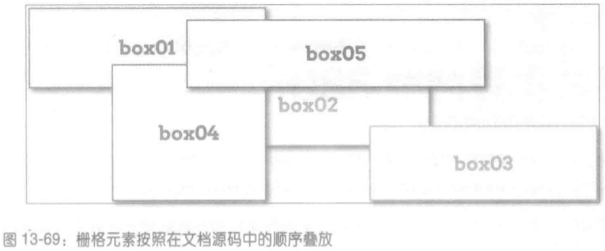

### z-index 属性

如果想自己设定顺序，可以使用 z-index 属性。与在定位中一样，z-index 设定元素在 z 轴 (垂直于显示平面) 上的位置。正值离你较近，负值离你较远。因此，如果想把第二个框放在 "上面"，只需把 z-index 设为比其他元素大的值：

```css
.box02 {
  z-index: 10;
}
```

### order 属性

调整栅格元素顺序的另一种方式是使用 order 属性。这个属性的作用与在弹性盒布局中一样，为栅格轨道中的栅格元素设定 order 值便可以改变栅格元素的顺序。受影响的不只元素在轨道中的位置，如果有重叠，绘制顺序也将受到影响。例如，可以像下面这样把前例中的 z-index 换成 order，得到的结果一样：

```css
.box02 {
  order: 10;
}
```
