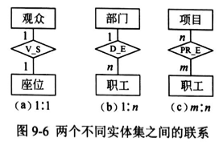
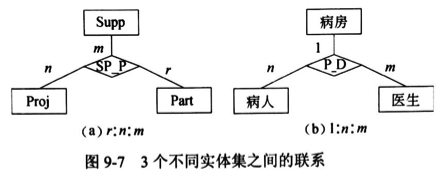
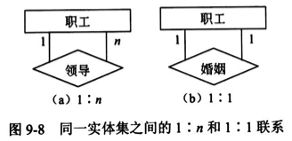
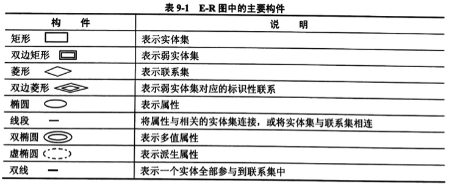
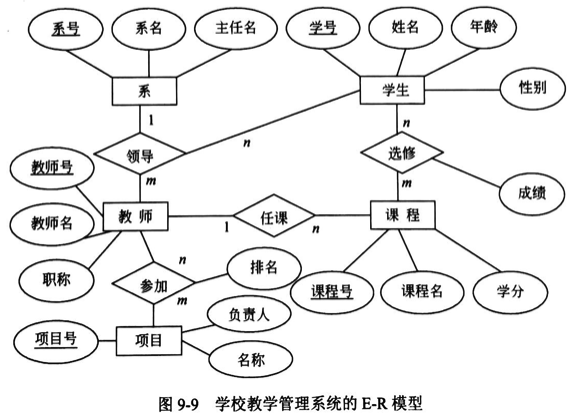
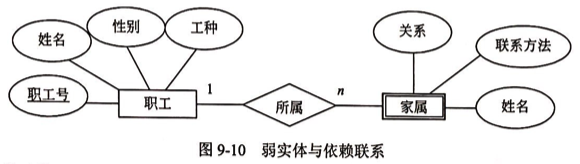
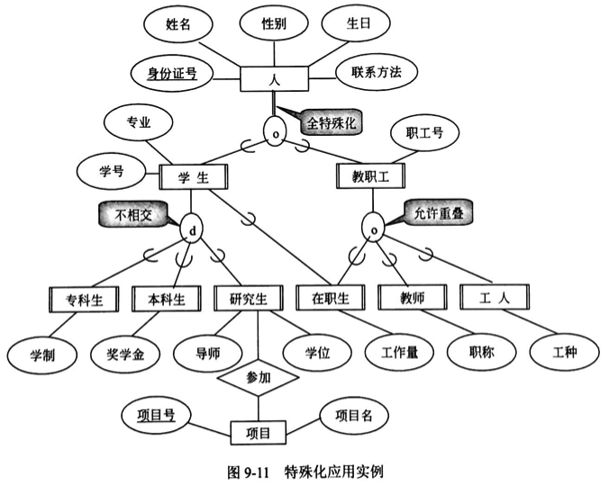

# E-R 模型

E-R 模型是软件工程设计中的一个重要方法，因为它接近于人的思维方式，容易理解并且与计算机无关，所以用户容易接受，是用户和数据库设计人员交流的语言。但是，E-R 模型只能说明实体间的语义联系，还不能进一步地详细说明数据结构。在解决实际应用问题时，通常先设计一个 E-R 模型，然后再把其转换成计算机能接受的数据模型。

## 实体

在 E-R 模型中，实体用矩形表示，通常矩形框内写明实体名。

**实体**是现实世界中可以区别于其他对象的 “事件” 或 “物体”。例如，企业中的每个人都是一个实体。

每个实体由一组**特性 (属性)** 来表示，其中的某一部分属性可以唯一标识实体，例如职工实体集中的职工号。

**实体集**是具有相同属性的实体集合。例如，学校的所有教师具有相同的属性，因此教师的集合可以定义为一个实体集；学生具有相同的属性，因此学生的集合可以定义为另一个实体集。

## 联系

在 E-R 模型中，联系用菱形表示，通常菱形框内写明联系名，并用无向边分别与有关实体连接起来，同时在无向边旁标注上联系的类型 (`1:1`、`1:n` 或 `m:n`)。

**1) 两个不同实体之间的联系**

两个不同实体集之间存在以下 3 种联系类型。

- 一对一 (1:1)。表示实体集 E(1) 中的一个实体最多只与实体集 E(2) 中的一个实体相联系。
- 一对多 (1:n)。表示实体集 E(1) 中的一个实体可与实体集 E(2) 中的多个实体相联系。
- 多对多(m:n)。表示实体集 E(1) 中的多个实体可与实体集 E(2) 中的多个实体相联系。

例如，图 9-6 表示两个不同实体集之间的联系。其中：

(1) 电影院里一个座位只能坐一个观众，一个观众只能占一个座位，因此观众与座位之间是一个 1:1 的联系，联系名为 V_S，用 E-R 图表示如图 9-6 (a) 所示。

(2) 若一个职工只能属于一个部门，一个部门能有多个职工，那么这两个实体集之间应是一个 1:n 的联系，联系名为 D_E，用 E-R 图表示如图 9-6 (b) 所示。

(3) 若一个职工可以参加多个项目，一个项目可以有多个职工参加，那么这两个实体集之间应是一个 m:n 的联系，联系名为 PR_E，用 E-R 图表示如图 9-6 (c) 所示。

**2) 两个以上不同实体集之间的联系**

两个以上不同实体集之间存在 `1:1:1`、`1:1:n`、`1:m:n` 和 `r:m:n` 的联系。例如，图 9-7 表示了 3 个不同实体集之间的联系。其中：

(1) 图 9-7 (a) 表示供应商 Supp、项目 Proj 和零件 Part 之间多对多对多 (`r:n:m`) 的联系，联系名为 SP_P。表示供应商为多个项目供应多种零件，每个项目可用多个供应商供应的零件，每种零件可由不同的供应商供应的语义。

(2) 图 9-7 (b) 表示病房、病人和医生之间一对多对多 (`1:n:m`) 的联系，联系名为 P_D。表示一个特护病房有多个病人和多个医生，一个医生只负责一个病房，一个病人只属于一个病房的语义。

:warning:注意，3 个实体集之间的多对多联系和 3 个实体集两两之间的多对多联系的语义是不同的。例如，供应商和项目实体集之间的 “合同” 联系，表示供应商为哪几个工程签了合同；供应商与零件两个实体集之间的 “库存” 联系，表示供应商库存零件的数量：项目与零件两个实体集之间的 “组成” 联系，表示一个项目由哪几种零件组成。

**3) 同一实体集内的二元联系**

同一实体集内的各实体之间也存在 `1:1`、`1:n` 和 `m:n` 的联系，如图 9-8 所示。

从图中可知，职工实体集中的领导与被领导的联系是 `1:n` 的。但是，职工实体集中的婚姻联系是 `1:1` 的。

## 属性

属性是实体某方面的特性。例如，职工实体集具有职工号、姓名、年龄、参加工作时间和通信地址等属性。

每个属性都有其取值范围，例如职工号为 000001~999999 的 6 位整型数，姓名为 10 位的字符串，年龄的取值范围为 18~60 等。

在同一实体集中，每个实体的属性及其域是相同的，但可能取不同的值。E-R 模型中的属性有以下分类。

(1) 简单属性和复合属性。简单属性是原子的、不可再分的，复合属性可以细分为更小的部分 (即划分为别的属性)。有时用户希望访问整个属性，有时希望访问属性的某个成分，那么在模式设计时可采用复合属性。例如，职工实体集的通信地址可以进一步分为邮编、省、市、街道。若不特别声明，通常指的是简单属性。

(2) 单值属性和多值属性。在前面所举的例子中，定义的属性对于一个特定的实体都只有单独的一个值。例如，对于一个特定的职工，只对应一个职工号、职工姓名，这样的属性称为单值属性。但是，在某些特定情况下，一个属性可能对应一组值。例如，职工可能有 0 个、1 个或多个亲属，那么职工的亲属的姓名可能有多个数目，这样的属性称为多值属性。

(3) NULL 属性。当实体在某个属性上没有值或属性值未知时，使用 NULL 值，表示无意义或不知道。

(4) 派生属性。派生属性可以从其他属性得来。例如，职工实体集中有 “参加工作时间” 和 “工作年限” 属性，那么 “工作年限” 的值可以由当前时间和参加工作时间得到。这里，“工作年限” 就是一个派生属性。

## 实体-联系方法

概念模型中最常用的方法为实体-联系方法，简称 E-R 方法。该方法直接从现实世界中抽象出实体和实体间的联系，然后用非常直观的 E-R 图来表示数据模型。

在 E-R 图中有如表 9-1 所示的几个主要构件。

说明：在 E-R 图中，实体集中作为主码的一部分属性以下划线标明。另外，在实体集与联系的线段上标上联系的类型。

【例 9.1】学校有若干个系，每个系有若干名教师和学生；每个教师可以担任若干门课程，并参加多个项目；每个学生可以同时选修多门课程。请设计该学校教学管理系统的 E-R 模型，要求给出每个实体、联系的属性。

解：该学校教学管理系统的 E-R 模型应该有 5 个实体，即系、教师、学生、项目和课程。

(1) 设计各实体属性如下：

系 (系号，系名，主任名)

教师 (教师号，教师名，职称)

学生 (学号，姓名，年龄，性别)

项目 (项目号，名称，负责人)

课程 (课程号，课程名，学分)

(2) 各实体之间的联系如下：

教师担任课程的 1:n “任课” 联系；教师参加项目的 n:m “参加” 联系；学生选修课程的 n:m “选修” 联系；教师、学生与系之间所属关系的 1:n:m “领导” 联系。其中，“参加” 联系有一个排名属性，“选修” 联系有一个成绩属性。

通过上述分析，该学校教学管理系统的 E-R 模型如图 9-9 所示。

## 扩充的 E-R 模型

尽管基本的 E-R 模型足以对大多数数据库特征建模，但数据库某些情况下的特殊语义仅用基本 E-R 模型无法表达清楚。

**1) 弱实体**

在现实世界中有一种特殊的联系，这种联系代表实体间的所有 (Ownership) 关系，例如职工与家属的联系，家属总是属于某职工的。这种实体对于另一些实体具有很强的依赖关系，即一个实体的存在必须以另一个实体为前提，将这类实体称为弱实体。

在扩展的 E-R 图中，弱实体用双线矩形框表示。图 9-10 为职工与家属的 E-R 图。

**2) 特殊化**

实体集是具有相同属性的实体集合。但在现实世界中，某些实体一方面具有一些共性，另一方面还具有各自的特殊性。这样，一个实体集可以按照某些特征区分为几个子实体。例如，学生实体集可以分为研究生、本科生和大专生等子集。将这种从普遍到特殊的过程称为 “特殊化”。

将几个具有共同特性的实体集概括成一个更普遍的实体集的过程称为 “普遍化”。例如，可以将大专生、本科生和研究生概括为学生，还可以将学生、教师和职工概括为人。这就是从特殊到一般的过程。

在扩充的 E-R 模型中，子类继承超类的所有属性和联系，但是，子类还有自己特殊的属性和联系。例如，研究生除了学习以外，还要参加科研项目。那么，研究生不仅要继承学生的所有属性，还要增加学位类型、导师的属性，并且需要增加与项目的联系。

在扩充的 E-R 图中，超类-子类关系模型使用特殊化圆圈和连线的一般方式来表示。超类到圆圈有一条连线，连线为双线表示全特殊化，连线为单线表示部分特殊化；双竖边矩形框表示子类；有符号 “U” 的线表示特殊化；圆圈中的 d 表示不相交特殊化；圆圈中的 o 表示重叠特殊化；超类与圆圈用单线相连，表示部分特殊化。图 9-11 给出了一个特殊化应用实例。

下面 P 表示人实体集、S 表示学生实体集、E 表示教职工实体集、S1 表示专科生实体集、S2 表示本科生实体集、S3 表示本科生实体集，E1 表示在职生，E2 表示教师，E3 表示工人，U 表示交集：

- 因为 S 和 E 是 P 的子类，且 S U E = P，所以为全特殊化。
- 因为 S 的每个实体只能是专科生、本科生或研究生中的一种，所以是不相交特殊化。
- 因为 S1 和 S2 和 S3 是 S 的子类，且 S1 U S2 U S3 != S（还有在职生），所以是部分特殊化。
- 因为 E 中的每个实体可以既是在职生又是教师或工人，所以是重叠特殊化。
- 因为 E1 和 E2 和 E3 是 E 的子类，且 E1 U E2 U E3 = E，所以是全特殊化。（:warning:此处图有误，应该为双线）
