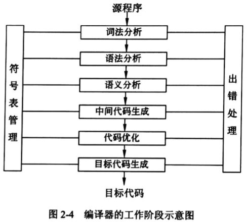
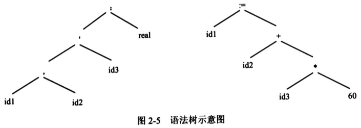
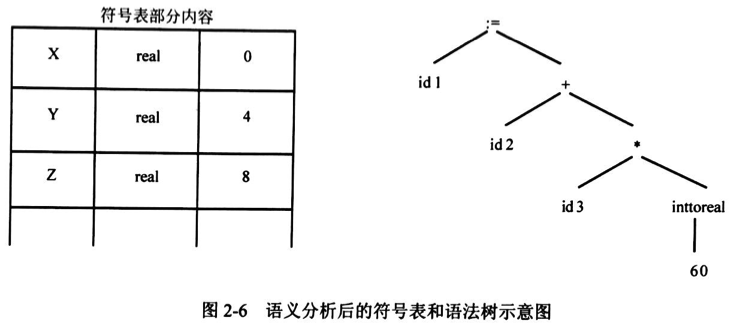

# 编译程序基本原理

## 编译过程概述

编译程序的功能是把某高级语言书写的源程序翻译成与之等价的目标程序 (汇编语言或机器语言)。

编译程序的工作过程可以分为 6 个阶段，如图 2-4 所示。



### 词法分析

词法分析阶段是编译过程的第一个阶段，这个阶段的任务是对源程序从前到后 (从左到右) 逐个字符地扫描，从中识别出一个个 “单词” 符号。

“单词” 符号是程序设计语言的基本语法单位，如关键字 (或称保留字)、标识符、常数、运算符和分隔符 (如标点符号、左右括号) 等。

词法分析程序输出的 “单词” 常以二元组的方式输出，即单词种别和单词自身的值。

词法分析过程依据的是语言的词法规则，即描述 “单词” 结构的规则。

例如，对于某 PASCAL 源程序中的一条声明语句和赋值语句：

```pascal
VAR X,Y,Z:real;
X:=Y+Z*60;
```

词法分析阶段将构成这条语句的字符串分割成如下的单词符号序列。

```
["保留字", "VAR"]
["标识符", "X"]
["逗号", ","]
["标识符", "Y"]
["逗号", ","]
["标识符", "Z"]
["冒号", ","]
["标准标识符", "real"]
["分号", ";"]
["标识符", "X"]
["赋值号", ":="]
["标识符", "Y"]
["加号", "+"]
["标识符", "Z"]
["乘号", "*"]
["整常数", "60"]
["分号", ";"]
```

### 语法分析

语法分析是在词法分析的基础上，根据语言的语法规则将单词符号序列分解成各类语法单位，如 “表达式” “语句” 和 “程序” 等。

语法规则就是各类语法单位的构成规则。通过语法分析确定整个输入串是否构成一个语法上正确的程序。如果源程序中没有语法错误，语法分析后就能正确地构造出其语法树；否则指出语法错误，并给出相应的诊断信息。

下面用 `id1`，`id2` 和 `id3` 分别代表 X、Y 和 Z。对单词符号序列进行语法分析后形成的语法树如图 2-5 所示。



词法分析和语法分析在本质上都是对源程序的结构进行分析。

### 语义分析

语义分析阶段分析语法树的含义，从而发现源程序是否包含静态语义错误，并收集类型信息供后面的代码生成阶段使用。

语义分析的一个主要工作是进行类型分析和检查。程序设计语言中的一个数据类型一般包含两个方面的内容：类型的载体及其上的运算。例如，PASCAL 整除取余运算符只能对整型数据进行运算，若其运算对象中有浮点数就认为是类型不匹配的错误。

```pascal
begin
  writeln (11.2 mod 5) // Fatal: Compilation aborted
end.
```

在确认源程序的静态语义正确之后，即可对其进行翻译并给出源程序的内部表示。

- 对于声明语句，需要记录所遇到的符号的信息，所以应进行符号表的填查工作。在图 2-6 所示的符号表中，每一行存放一个符号的信息。第一行存放标识符 X 的信息，其类型为 real，为它分配的逻辑地址是 0；第二行存放 Y 的信息，其类型是 real，为它分配的逻辑地址是 4；第三行存放 Z 的信息，其类型是 real，为它分配的逻辑地址是 8。在 PASCAL 语言中，为一个 real 型数据分配的存储空间是 4 个存储单元。
- 对于可执行语句，则检查结构合理的表达式是否有意义。对 `idl:=id2+id3*60` 进行语义分析后的语法树如图 2-6 所示，其中增加了一个语义处理结点 inttoreal，该运算用于将一个整型数转换为浮点数。



### 中间代码生成

中间代码生成阶段的任务是根据语义分析的输出生成中间代码。"中间代码” 是一种简单且含义明确的记号系统，可以有若干种形式，它们的共同特征是与具体的机器无关。最常用的一种中间代码是与汇编语言的指令非常相似的三地址码，其实现方式常采用四元式。四元式的形式为：

```
[运算符, 运算对象1, 运算对象2, 运算结果]
```

例如，对于语句 `X:=Y+Z*60`，可生成以下四元式序列：

```
[inttoreal, 60, -, tl]
[*, id3, t1, t2]
[+, id2, t2, t3]
[:=, t3, - , id1]
```

其中，t1、t2、t3 是编译程序生成的临时变量，用于存放临时的运算结果。

### 代码优化

由于编译器将源程序翻译成中间代码的工作是机械的、按固定模式进行的，因此，生成的中间代码往往在时间上和空间上有较大的浪费。当需要生成高效的目标代码时，必须进行优化。

优化过程可以在中间代码生成阶段进行，也可以在目标代码生成阶段进行。由于中间代码不依赖于具体机器，此时所做的优化一般建立在对程序的控制流和数据流分析的基础之上，与具体的机器无关。

优化所依据的原则是程序的等价变换规则。例如，在生成 `X:=Y+Z*60` 的四元式后，60 是编译时已知的常数，把它转换为 60.0 的工作可以在编译时完成，没有必要生成一个四元式，同时 t3 仅仅用来将其值传递给 id1，也可以将其简化掉，因此上述的中间代码可优化成下面的等价代码：

```
[*, id3, 60.0, t1]
[+, id2, tl, id1]
```

这只是优化工作中的一个简单示例，实际的优化工作还要涉及公共子表达式的提取、循环优化等更多的内容和技术。

### 目标代码的生成

目标代码生成是编译器工作的最后一个阶段。

这一阶段的任务是把中间代码变换成特定机器上的**绝对指令代码**、**可重定位的指令代码**或**汇编指令代码**，这个阶段的工作与具体的机器密切相关。例如，使用两个寄存器 R1 和 R2，可对上述的四元式生成下面的目标代码：

```
MOVF id3, R2
MULF #60.0, R2
MOVF id2, R1
ADDF R2,R1
MOVF R1, id1
```

这里用 # 表明 60.0 为常数。

### 符号表管理

符号表的作用是记录源程序中各个符号的必要信息，以辅助语义的正确性检查和代码生成，在编译过程中需要对符号表进行快速有效地查找、插入、修改和删除等操作。

符号表的建立可以始于词法分析阶段，也可以放到语法分析和语义分析阶段，但符号表的使用有时会延续到目标代码的运行阶段。

### 出错处理

用户编写的源程序不可避免地会有一些错误，这些错误大致可分为静态错误和动态错误。

- 动态错误也称动态语义错误，它们发生在程序运行时，例如变量取零时做除数、引用数组元素下标错误等。
- 静态错误是指编译阶段发现的程序错误，可分为语法错误和静态语义错误，如单词拼写错误、标点符号错误、表达式中缺少操作数、括号不匹配等有关语言结构上的错误称为语法错误，而语义分析时发现的运算符与运算对象类型不合法等错误属于静态语义错误。在编译时发现程序中的错误后，编译程序应采用适当的策略修复它们，使得分析过程能够继续下去，以便在一次编译过程中尽可能多地找出程序中的错误。

### 前端和后端

对于编译过程的各个阶段，在逻辑上可以把它们划分为前端和后端两部分。

- 前端包括从词法分析到中间代码生成各阶段的工作。
- 后端包括中间代码优化和目标代码的生成、优化等阶段。

这样，以中间代码为分水岭，把编译器分成了与机器有关的部分和与机器无关的部分。如此一来：

- 对于同一种程序设计语言的编译器，开发出一个前端之后，就可以针对不同的机器开发相应的后端，前、后端有机结合后就形成了该语言的一个编译器。当语言有改动时，只会涉及前端部分的维护。
- 对于不同的程序设计语言，分别设计出相应的前端，然后将各个语言的前端与同一个后端相结合，就可以得到各个语言在某种机器上的编译器。
