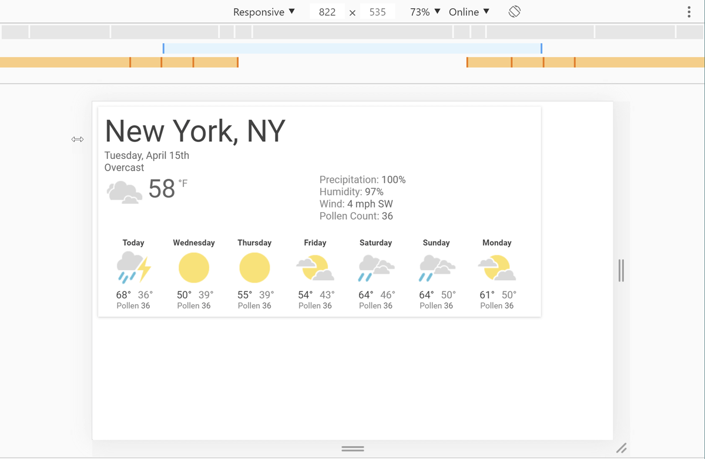
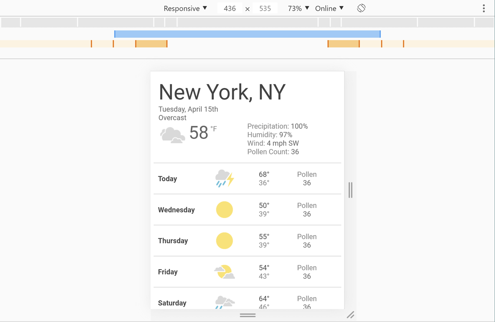

# 响应式网页设计

早期的网页设计，有两种选择：

- "固定宽度" 的网页设计，即固定宽度的网页。因此，如果用户使用的是较小的屏幕，则会出现一个水平滚动条；如果用户使用的是较大的屏幕，则网页边缘会有多余的空白区域没有被合理利用。
- "液态宽度" 的网页设计，即拉伸宽度以充满整个浏览器视口的网页。因此，如果用户使用的是较小的屏幕，则可能会导致网页内容会挤成一团 (例如：多列布局)；如果用户使用的是大屏幕，则可能会导致网页内容被拉伸的太长 (例如：单列布局)。

随着移动 Web 在功能手机上的普及，越来越多的公司希望拥抱移动端，并希望为他们的网页创建一个移动版本。这意味着一个网页需要开发两个不同的版本，移动版本和桌面版本，并且需要确保多端之间的时效性，维护成本较高。

除此之外，随着支持 Web 的设备类型不断增多，例如：手机、平板、电脑、电视等，传统的两个版本网页已经不能满足多种设备类型的需要。而且不同设备之间的屏幕大小、分辨率、方向等因素也没有一个清晰的界限，这给网页设计师和开发者带来了巨大的挑战。

为了解决这个问题，响应式网页设计 (RWD，responsive web design) 应运而生，RWD 采用媒体查询和弹性栅格布局等技术，能够让网页根据不同设备的屏幕大小、分辨率、方向等因素，自动调整布局和外观，使用户在不同设备上都可以获得良好的体验。不仅如此，采用 RWD 可以降低网页维护和更新的成本。

## 实现技术

响应式网页设计并不是一项单独的技术，而是一种应用多种技术来创建适应不同设备的样式的网页设计方式或一组最佳实践的术语。

### 媒体查询

媒体查询是一种响应式网页设计技术，它允许网页根据特定媒体条件 (例如：屏幕尺寸、分辨率) 的断点，自动调整样式和布局。

在响应式网页设计中，我们可能会在小屏幕上采用单栏布局，在大屏幕上采用多栏布局。为了实现这种布局效果，我们可以使用媒体查询，并根据屏幕宽度设置一至多个断点，以便在屏幕宽度达到特定值时，从单列布局切换到多列布局。

#### 什么是断点

断点 (breakpoints) 是指样式改变时的点。在媒体查询中，由媒体条件来指定，媒体条件包括了媒体类型和媒体特性描述符。例如：

```css
/* 当屏幕宽度小于等于 768 像素时，文本颜色为红色 */
@media (max-width: 768px) {
  body {
    color: red;
  }
}
/* 当屏幕宽度大于等于 769 像素时，文本颜色为蓝色 */
@media (min-width: 769px) {
  body {
    color: blue;
  }
}
```

在这个例子中，我们使用了两个断点。第一个断点 `(max-width: 768px)` 表示当屏幕宽度小于等于 768 像素时，应用其中的样式。第二个断点 `(min-width: 769px)` 表示当屏幕宽度大于等于 769 像素时，应用其中的样式。

#### 如何选择断点

在设计响应式布局时，了解如何选择断点是非常重要的。有两种主要方式：

- 基于设备的断点
- 基于内容的断点

##### 基于设备

由于市场上新设备的快速发布，根据设备类型确定断点的方法变得越来越具有挑战性，这种方法可能不再可行。因为随着每个新设备在市场上发布，开发人员就必须添加与该设备兼容的断点和样式。例如：

**iPhone 12 Mini**

```css
/* ----------- iPhone 12 Mini ----------- */
/* 2340x1080 pixels at 476ppi */
@media only screen and (device-width: 360px) and (device-height: 780px) and (-webkit-device-pixel-ratio: 3) {
}
```

**iPhone 12、12 Pro**

```css
/* ----------- iPhone 12, 12 Pro ----------- */
/* 2532x1170 pixels at 460ppi */
@media only screen and (device-width: 390px) and (device-height: 844px) and (-webkit-device-pixel-ratio: 3) {
}
```

**iPhone 11**

```css
/* ----------- iPhone 11 ----------- */
/* 1792x828px at 326ppi */
@media only screen and (device-width: 414px) and (device-height: 896px) and (-webkit-device-pixel-ratio: 2) {
}
```

**OnePlus 6**

```css
/* ----------- OnePlus 6 ----------- */
@media only screen and (min-width: 412px) and (max-width: 869px) {
}
```

##### 基于内容

相对而言，基于内容的断点更易于编码和管理。在这种方法中，当网页在某个视口大小下的布局阻碍了可读性时，我们只需要设置一个断点，以提高网页在这个视口大小下的可读性。

**适用于 768px 及以上的屏幕分辨率**

```css
@media only screen and (min-width: 768px) {
}
```

**适用于 769px 至 960px 之间的屏幕分辨率**

```css
@media only screen and (min-width: 769px) and (max-width: 960px) {
}
```

#### 移动优先和桌面优先

在设计和开发阶段时，一种通用的方法是，首先将网页设计为适合小屏幕尺寸的布局，然后逐渐扩展屏幕尺寸，直到需要设置断点。这种做法使你能够基于内容来优化断点，同时保持尽可能少的断点。这种设计方法通常被称为 "移动优先" 设计。例如：首先为窄屏设备 (如移动设备) 创建一个简单的单栏布局，然后逐步扩展屏幕尺寸，再为宽屏设备 (如桌面设备) 创建一个复杂的多栏布局。

```css
/* 小屏幕单栏布局 */
.left,
.main,
.right {
  width: 100%;
}

/* 大屏幕多栏布局 */
@media screen and (min-width: 768px) {
  .left,
  .right {
    float: left;
    width: 20%;
  }

  .main {
    float: left;
    width: 60%;
  }
}
```

在这个示例中，我们使用媒体查询来实现小屏幕和大屏幕不同的布局。对于小屏幕，我们使用单栏布局，其中 left、main、right 元素的宽度都设置为 100%。对于大屏幕，我们使用多栏布局，其中 left、right 元素的宽度设置为 20%，main 元素的宽度设置为 60%，它们都左浮动。

#### Chrome DevTools 查看断点

根据屏幕宽度设置了媒体查询断点后，你可能想查看网页在不同断点下的呈现效果。虽然你可以调整浏览器窗口大小来触发这些断点，但 Chrome DevTools 有一项内置功能，可以让你轻松查看网页在不同断点下的呈现效果。



_DevTools 显示的天气应用程序在较宽的可视区域下的呈现效果。_



_DevTools 显示的天气应用程序在较窄的可视区域下的呈现效果。_

### 响应式布局

响应式布局是指可以根据不同设备自动调整网页宽度和高度等样式的技术，以保证在不同设备上能够更好地显示网页内容。这些技术经常结合媒体查询使用。

#### 百分比浮动布局

在早期，进行响应式页面设计时，我们唯一的实现布局的选项是使用百分比浮动布局。百分比浮动布局是这样实现的，让每个元素都有一个百分比值的宽度，而且确保整个布局的和不超过 100%。例如，我们的预期栏宽度为 60 像素，它所在的容器宽度为 960 像素，那么我们用 60 除以 960，得到该栏占容器的百分比值。

```css
.col {
  width: 6.25%; /* 60 / 960 = 0.0625 */
}
```

**单独使用**

来看一个单独使用的例子：

```css
.col1,
.col2 {
  width: 50%;
  height: 100px;
  float: left;
}

.col1 {
  background-color: red;
}

.col2 {
  background-color: blue;
}
```

上述代码，col1 和 col2 采用多栏布局，而当视口缩小时，col1 和 col2 的宽度响应式地缩小。

**结合媒体查询使用**

来看一个结合媒体查询使用的例子：

```css
/* 在默认时，col1 和 col2 为单栏布局 */
.col1,
.col2 {
  width: 100%;
  height: 100px;
}

.col1 {
  background-color: red;
}

.col2 {
  background-color: blue;
}

/* 在视口大于等于 600px 时，col1 和 col2 为多栏布局 */
@media (min-width: 600px) {
  .col1 {
    width: 50%;
    float: left;
  }

  .col2 {
    width: 50%;
    float: right;
  }
}
```

上述代码，在默认情况下，col1 和 col2 采用单栏布局，而当视口大于等于 600px 时，col1 和 col2 采用多栏布局。

#### 弹性盒布局

弹性盒布局可以让弹性容器内的子元素在可用空间内自动排列。

**单独使用**

来看一个单独使用的例子：

```css
.container {
  display: flex;
  flex-direction: row;
}

.col1,
.col2 {
  flex: 1 0 0%;
  height: 100px;
}

.col1 {
  background-color: red;
}

.col2 {
  background-color: blue;
}
```

上述代码，col1 和 col2 采用多栏布局，而当视口缩小时，col1 和 col2 的宽度响应式地缩小。

来看一个单独使用的例子：

```css
/* 在弹性容器宽度小于 600px 时，col1 和 col2 为单栏布局 */
/* 在弹性容器宽度大于等于 600px 时，col1 和 col2 为多栏布局 */
.container {
  display: flex;
  flex-direction: row;
  flex-wrap: wrap;
}

.col1,
.col2 {
  flex: 1 1 auto;
  width: 300px;
  height: 100px;
}

.col1 {
  background-color: red;
}

.col2 {
  background-color: blue;
}
```

在上面的代码中，我们主要是声明：

- container 弹性容器 `flex-direction: row; flex-wrap: wrap;`，即主轴方向从左到右，当弹性元素在弹性容器中放不下时允许换行。
- col1 和 col2 弹性元素 `flex: 1 1 auto;`，即弹性元素在主轴上可伸长，可缩短，默认尺寸基于主轴方向 (因为弹性容器的主轴是横向的，所以弹性元素的主轴尺寸为 `width: 300px`)。

上述代码，在默认情况下，col1 和 col2 采用单栏布局，而当弹性容器宽度大于等于 600px，即可以同时放下 col1 和 col2 时，col1 和 col2 采用多栏布局。

**结合媒体查询使用**

来看一个结合媒体查询使用的例子：

```css
/* 在默认时，col1 和 col2 为单栏布局 */
.container {
  display: flex;
  flex-direction: column;
}

.col1,
.col2 {
  flex: 1 1 auto;
  height: 100px;
}

.col1 {
  background-color: red;
}

.col2 {
  background-color: blue;
}

/* 当视口大于等于 600px 时，col1 和 col2 为多栏布局 */
@media (min-width: 600px) {
  .container {
    flex-direction: row;
  }
}
```

上述代码，在默认情况下，col1 和 col2 采用单栏布局，而当视口大于等于 600px 时，col1 和 col2 采用多栏布局。

#### 栅格布局

栅格布局可以让栅格容器内的子元素按照行与列的格式进行排列。

**单独使用**

来看一个单独使用的例子：

```css
.container {
  display: grid;
  grid-template-columns: 1fr 1fr;
  grid-template-rows: 100px;
}

.col1 {
  background-color: red;
}

.col2 {
  background-color: blue;
}
```

上述代码，col1 和 col2 采用多栏布局，而当视口缩小时，col1 和 col2 的宽度响应式地缩小。

**结合媒体查询使用**

来看一个结合媒体查询使用的例子：

```css
.container {
  display: grid;
  grid-template-columns: 1fr;
  grid-template-rows: repeat(2, 100px);
}

.col1 {
  background-color: red;
}

.col2 {
  background-color: blue;
}

/* 在视口大于等于 600px 时，col1 和 col2 在容器中为多列布局 */
@media (min-width: 600px) {
  .container {
    grid-template-columns: 1fr 1fr;
    grid-template-rows: 100px;
  }
}
```

上述代码，在默认情况下，col1 和 col2 采用单栏布局，而当视口大于等于 600px 时，col1 和 col2 采用多栏布局。

### 响应式文本

响应式文本是指可以根据不同设备自动调整字体大小和行间距等样式的技术，以保证在不同设备上能够更好地显示文本内容。这些技术经常结合媒体查询使用。

**单独使用**

来看一个单独使用的例子：

```css
h1 {
  font-size: 10vw;
}
```

**结合媒体查询使用**

来看一个结合媒体查询使用的例子：

```css
html {
  font-size: 1em;
}

h1 {
  font-size: 2rem;
}

/* 在视口大于等于 1200px 时，h1 的文本大小设置为 4rem */
@media (min-width: 1200px) {
  h1 {
    font-size: 4rem;
  }
}
```

### 响应式图像

响应式文本是指可以根据不同设备自动调整图片大小和内容等因素的技术，以保证在不同设备上能够更好地显示图片内容。

#### 使用 width 属性

如果 `width` 属性设置为 100%，图像将响应式地缩放。例如：

```html

```

上述代码，虽然图像可以根据包含块宽度响应式地缩放，但将图像缩放到比其原始尺寸更大会导致像素化。

#### 使用 max-width 属性

如果 `max-width` 属性设置为 100%，图像将在必要时缩小，但永远不会缩放到比原始尺寸更大。例如：

```html

```

上述代码，图像可以根据包含块宽度响应式地缩放，但永远不会缩放到比原始尺寸更大。

这种方式也存在弊端：

- 图像有可能会显示得比它的原始尺寸小很多，以至于浪费带宽。例如：一个移动端用户会下载几倍于他在桌面端中实际看到的大小的图像。
- 你可能不想在移动端和桌面端有相同的图像宽高比例。例如，在移动端时，方形图像的表现会很好，但在桌面端显示同样的内容，宽形图像的表现会更好。
- 你可能需要在移动端和桌面端展示一张不同的图像。

#### 显示不同的图像取决于浏览器的宽度

响应式图像使用 `<picture>` 元素和 `` 的 `srcset` 和 `sizes` 属性，解决了这两个问题。你可以提供附带着“提示”（描述图像最适合的屏幕尺寸和分辨率的元数据）的多种尺寸，浏览器将会选择对设备最合适的图像，以确保用户下载尺寸适合他们使用的设备的图像。

##### ``

**真实尺寸**

如果你需要根据媒体条件和设备像素比显示不同的图像，我们可以使用 `srcset` 和 `sizes` 属性，帮助浏览器选择合适的图片。例如：

```html

```

`srcset` 定义了浏览器可选择的图片设置，每张图片设置之间用逗号隔开，每张图片设置：

1. 一个文件名 (`elva-fairy-480w.jpg`)
2. 一个空格
3. 图片的固有宽度 (以像素为单位) (480w)。注意，这里使用宽度描述符 `w`，而非你可能期望的 `px`。图片的固有宽度是它的真实尺寸。

`sizes` 定义了一组媒体条件，每个媒体设置之间用逗号隔开，每个媒体设置有：

1. 一个媒体条件 (`(max-width:600px)`)
2. 一个空格
3. 当媒体条件为真时，图像将填充的槽宽度 (`480px`)

有了这些属性后，浏览器会：

1. 检查 `sizes` 列表中哪个媒体条件为真，选中槽宽度
2. 加载 `srcset` 列表中最接近设备像素比 (device-pixel-ratio) 和所选的槽宽度的图像

**设备像素比**

如果你需要根据设备像素比显示不同的图像，你可以使用 `srcset` 结合 `x` 语法，不需要设置 `sizes`，帮助浏览器选择合适的图像。例如：

```html

```

上述代码，浏览器会根据设备像素比显示 `srcset` 引用的最合适的图像。

##### **`<picture>`**

如果你需要根据媒体条件显示不同的图像，你可以使用 `<picture>` 标签。例如：

```html
<picture>
  <source media="(max-width: 799px)" srcset="elva-480w-close-portrait.jpg" />
  <source media="(min-width: 800px)" srcset="elva-800w.jpg" />
  
</picture>
```

`<source>` 元素的属性：

- `media` 属性包含一个媒体条件，这些条件来决定哪张图像会显示。
- `srcset` 属性包含要显示图像的路径。

注意，在任何情况下，你都必须在 `</picture>` 之前正确提供一个 `` 元素以及它的 `src` 和 `alt` 属性，否则不会有图像显示。如果所有媒体条件都为假或浏览器不支持 `<picture>` 元素，它会作为默认图像显示。

## 注意事项

### 设置可视区域

如果你看过响应式网页的 HTML 源代码，通常会在网页的 `<head>` 标签中找到以下的 `<meta>` 标签。

```html
<meta name="viewport" content="width=device-width, initial-scale=1" />
```

这个 `<meta>` 标签告诉移动端浏览器，应该将视口宽度设定为设备的实际视口宽度，并将文档放大至其预期大小的 100%。

> 为什么需要这个标签呢？
>
> 这个 meta 标签的存在，是因为从 iPhone 发布以后，人们开始在小屏幕的移动设备上浏览网页，而大多数网站并未针对移动端做优化。因此，苹果移动端浏览器会将默认视口宽度设为 960 像素，并以这个宽度来渲染页面，结果展示的是桌面布局的缩放版本。其他移动端浏览器 (例如：在安卓上的谷歌浏览器) 也采用相同的方式，但不同的移动端浏览器默认视口宽度设定的值可能不同。用户可以通过缩放、滚动来查看网站中感兴趣的部分，但这种体验查看起来非常不舒服。如果你不幸遇到一个没有响应式网页设计的网站，今天你仍然可能会遇到这种情况。
>
> 移动端浏览器会将默认视口宽度设为固定像素值，这相当于回到了 "固定宽度" 的网页设计，会导致响应式网页设计失效。例如：
>
> - 媒体查询的 `min-width`、`max-width` 等断点是以视口为基准，固定像素值的默认视口宽度会导致媒体查询不能以不同设备的实际视口宽度应用特定的样式。
> - 根元素的宽度是以视口为基准，固定像素值的默认视口宽度会导致很多布局技术不能以不同设备的实际视口宽度自适应。
>
> 通过设定 `width=device-width`，以设备的实际视口宽度覆写了默认视口宽度，这样媒介查询和布局就会根据不同的视口宽度应用特定的样式和自适应。
>
> 需要注意的是，这个标签只对移动端浏览器有效，对桌面端浏览器没有影响，桌面端浏览器的视口宽度为浏览器的实际视口宽度，设置这个标签还可以让网页在移动端浏览器和桌面端浏览器都是以实际视口宽度渲染。

#### 确保可视区域的可访问性

在 viewport meta 标签中，还可以设置 `height`、`minimum-scale`、`maximum-scale`、`user-scalable` 等，但是通常情况应该避免使用 `minimum-scale`、`maximum-scale`，尤其是将 `user-scalable` 设为 `no`，来阻止用户缩放。用户应该有权力进行缩放，阻止这种操作会引起访问性问题。

## 参考

[HTML Responsive Web Design (w3schools.com)](https://www.w3schools.com/html/html_responsive.asp)

[响应式网页设计基础知识 (web.dev)](https://web.dev/responsive-web-design-basics/)

[响应式设计 - 学习 Web 开发 | MDN (mozilla.org)](https://developer.mozilla.org/zh-CN/docs/Learn/CSS/CSS_layout/Responsive_Design)

[响应式图片 - 学习 Web 开发 | MDN (mozilla.org)](https://developer.mozilla.org/zh-CN/docs/Learn/HTML/Multimedia_and_embedding/Responsive_images)

[如何使用 CSS 断点进行响应式设计 |λ 测试 (lambdatest.com)](https://www.lambdatest.com/blog/how-to-use-css-breakpoints-for-responsive-design/)
