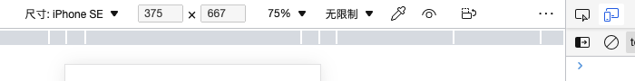

# 视口

## 视口种类

浏览器有三种视口：视觉视口、布局视口、理想视口。

### 视觉视口

视觉视口 (visual viewport) 是指页面的可视区域 (包括滚动条宽度)。


我们可以通过 `window.visualViewport` 获取 VisualViewport 对象，该对象包括一组描述视觉视口的属性，以及两个事件 onresize 和 onscroll，事件会在视觉视口发生变化时触发。

我们可以通过 `window.visualViewport.width / height`，来获取视觉视口的大小。

### 布局视口

布局视口 (layout viewport) 是指页面布局的基准窗口。

当我们以百分比来指定一个元素的大小时，它的计算值是由这个元素的包含块计算而来的。当这个元素是最顶级的元素时，它就是基于布局视口来计算的。


我们可以通过 viewport meta 标签来设置布局视口。

我们可以通过 `document.documentElement.clientWidth / clientHeight` 来获取布局视口的大小。

### 理想视口

理想视口 (ideal viewport) 是指设备屏幕的尺寸，以设备独立像素为单位。因此，它是全屏页面的理想尺寸，即当页面尺寸等于理想视口时，不会有滚动条。

不同设备的理想视口可能不同，例如：iPhone SE 是 375 x 667，Pixel 4 是 353 x 745。在 Chrome DevTools 的设备仿真中，上面显示的就是设备的理想视口。



我们可以通过 `screen.width / height` 来获取理想视口的大小。

## 交互操作

有些交互操作可能会影响视口。

### 滚动操作

当页面大于视觉视口时，会出现滚动条。

在移动端浏览器中，滚动操作可以移动视觉视口，而页面保持不动。我们可以通过滚动操作来移动视觉视口，从而看到页面的其他部分。例如：

```javascript
window.visualViewport.onscroll = () => {
  console.log(
    `视觉视口的横纵向移动量：${window.visualViewport.offsetLeft} * ${window.visualViewport.offsetTop}`
  );
  console.log(
    `页面的横纵向移动量：${window.pageXOffset} * ${window.pageYOffset}`
  );
};
```

在桌面端浏览器中，滚动操作可以移动页面，而视觉视口保持不动。我们可以通过滚动操作来移动页面，从而看到页面的其他部分。例如：

```javascript
window.onscroll = () => {
  console.log(
    `视觉视口的横纵向移动量：${window.visualViewport.offsetLeft} * ${window.visualViewport.offsetTop}`
  );
  console.log(
    `页面的横纵向移动量：${window.pageXOffset} * ${window.pageYOffset}`
  );
};
```

### 缩放操作

> 桌面端浏览器没有缩放操作。

在移动端浏览器中，缩放操作可以缩放视觉视口大小，但布局视口保持不变。

放大操作可以缩小视觉视口，用户看到的可视区域 (视觉视口) 会变小，但布局视口保持不变。例如，一个捏的手势通常可以用来放大和缩小页面，我们可以触发缩放操作，并在 Chrome DevTools 的控制台打印视觉视口和布局视口。

```js
console.log("视觉视口的横向尺寸：", window.visualViewport.width);
console.log("视觉视口的纵向尺寸：", window.visualViewport.height);
console.log("布局视口的横向尺寸：", document.documentElement.clientWidth);
console.log("布局视口的纵向尺寸：", document.documentElement.clientHeight);
```

### 窗口操作

> 移动端浏览器没有窗口操作。

在桌面端浏览器中，窗口操作可以改变视觉视口和布局视口大小。例如：

```javascript
window.onresize = () => {
  console.log(
    `视觉视口：${window.visualViewport.width} * ${window.visualViewport.height}`
  );
  console.log(
    `布局视口：${document.documentElement.clientWidth} * ${document.documentElement.clientHeight}`
  );
};
```

## viewport meta 标签

在移动端浏览器中，我们可以在 `<head>` 标签中添加 viewport meta 标签来设置视口。例如：

```html
<head>
  <meta
    name="viewport"
    content="width=device-width, initial-scale=1, maximum-scale=1, minimum-scale=1, user-scalable=no"
  />
</head>
```

viewport meta 标签的属性，如下所示：

| 属性键               | 属性值                                                                                                                                                                                                                                                                                                             | 描述                                                      |
| -------------------- | ------------------------------------------------------------------------------------------------------------------------------------------------------------------------------------------------------------------------------------------------------------------------------------------------------------------ | --------------------------------------------------------- |
| `width`              | 像素值 `[1, 10000]` (如 `width=600`)、理想视口的横向尺寸 `device-width`                                                                                                                                                                                                                                            | 定义布局视口的横向尺寸                                    |
| `height`             | 像素值 `[1, 10000]` (如 `height=600`)、理想视口的纵向尺寸 `device-height`                                                                                                                                                                                                                                          | 定义布局视口的纵向尺寸                                    |
| `initial-scale`      | 数值 `[0.25, 10]`。默认值为 `1`                                                                                                                                                                                                                                                                                    | 定义页面首次加载时显示的缩放倍数                          |
| `minimum-scale`      | 数值 `[0.1, 10]`。默认值为 `1`                                                                                                                                                                                                                                                                                     | 定义页面允许缩小的倍数，必须小于等于 `maximum-scale` 的值 |
| `maximum-scale`      | 数值 `[0.1, 10]`。默认值为 `1`                                                                                                                                                                                                                                                                                     | 定义页面允许放大的倍数，必须大于等于 `minimum-scale` 的值 |
| `user-scalable`      | `0`、`1`、`no`、`yes`。默认值为 `1`                                                                                                                                                                                                                                                                                | 定义是否允许页面缩放操作                                  |
| `interactive-widget` | `resizes-visual`：视觉视口被交互式组件调整大小<br />`resizes-content`：布局视口被交互式组件调整大小<br />`overlays-content`：视觉视口和布局视口都不会被交互式组件调整大小<br />默认值为 `resizes-visual`。<br />注意：当布局视口的大小被调整时，布局布局和包含块的大小也会被调整，会影响视口单位的计算所得的大小。 | 定义交互式 UI 组件 (如虚拟键盘) 对视口的影响。            |

### 默认布局视口大小

默认的布局视口有多宽？这因浏览器而异。例如：Safari iPhone 使用 980px，Opera 使用 850px，Android WebKit 使用 800px，IE 使用 974px。

### 设置布局视口大小

viewport meta 标签可以设置布局视口大小。例如：

```html
<meta name="viewport" content="width=device-width, initial-scale=1" />
```

注意：最终的布局视口不仅与 `width/height` 属性值有关，还与 `initial-scale` 属性值，以及理想视口有关。它的计算公式如下：

```
布局视口的横向尺寸 = max(width 属性值, 理想视口的横向尺寸 / initial-scale)
布局视口的纵向尺寸 = max(height 属性值, 理想视口的纵向尺寸 / initial-scale)
```

可以看到，最终的布局视口取决于：

- `width` 属性值和 `理想视口的横向尺寸 / initial-scale` 之间的最大值；
- `height` 属性值和 `理想视口的纵向尺寸 / initial-scale` 之间的最大值。

**例子**

> 下述例子，在 iPhone SE 中运行，它的理想视口为 375 x 667。

- 先来看一个例子：

```html
<meta name="viewport" content="width=device-width, initial-scale=0.25" />
```

我们设置 `width=device-width` 为理想视口 375，而 `initial-scale=0.25` 为 `375 / 0.25 = 1500`。因此，最终的布局视口为 1500。

- 再来看一个例子：

```html
<meta name="viewport" content="width=1600, initial-scale=0.25" />
```

我们设置 `width=1600` 为 1600，而 `initial-scale=0.25` 为 `375 / 0.25 = 1500`。因此，最终的布局视口为 1600。

上述例子，我们可以在 Chrome DevTools 的设备仿真中，并在控制台中打印 `document.documentElement.clientWidth` 布局视口的横向尺寸。

## viewport 单位

在 CSS 中，viewport 单位有 `vw`、`vh`、`vmin`、`vmax`。如下所示：

| 单位   | 描述                                     |
| ------ | ---------------------------------------- |
| `vw`   | `1vw` 等于布局视口的横向尺寸的 1%。      |
| `vh`   | `1vh` 等于布局适口的纵向尺寸的 1%。      |
| `vmin` | `1vmin` 等于 `1vw` 或 `1vh` 中的较小者。 |
| `vmax` | `1vmax` 等于 `1vw` 或 `1vh` 中的较大者。 |

**例子**

> 下述例子，在 iPhone SE 中运行，它的理想视口为 375 x 667。

- 来看一个例子：

```html
<!DOCTYPE html>
<html>
  <head>
    <meta charset="UTF-8" />
    <meta name="viewport" content="width=1000, initial-scale=1" />
    <style>
      html {
        background: yellow;
      }
      .box {
        width: 20vw;
        height: 100px;
        background: white;
      }
    </style>
  </head>
  <body>
    <div class="box">CokeBeliever</div>
  </body>
</html>
```

上述代码，我们设置布局视口的横向尺寸为 1000。因此，`.box` 元素的宽度 20vw 就等于 `1000 * 20%` 为 200px。

## 多端适配

- 先思考一个问题：什么样的页面尺寸可以提供更好的用户体验？

无论是桌面端还是移动端，其实都应该避免页面出现横向滚动条，可以有纵向滚动条。

为了避免页面出现横向滚动条，页面的横向尺寸应该小于等于视觉视口。注意，缩放操作会影响视觉视口，这也就意味着原本没有滚动条的页面，也有可能在用户的交互操作下出现滚动条。但是基于用户体验考虑，这种交互操作是应该允许的。**因此，我们应该避免的是：首次加载页面时出现横向滚动条**。

- 再思考一个问题：面对不同的设备，应该如何做适配？

我们知道，不同设备的理想视口可能不同。**因此，在页面布局时，页面的横向尺寸不能为固定值，它应该以设备的理想视口的横向尺寸为基准**。由于布局视口是页面布局的基准窗口。因此，我们需要在 viewport meta 标签中设置布局视口的横向尺寸等于理想视口的横向尺寸：

```html
<meta name="viewport" content="width=device-width, initial-scale=1" />
```

设置 viewport meta 标签后，在页面局部时，我们就可以让页面的横向尺寸基于布局视口的横向尺寸做百分比布局、viewport 单位布局，来适配不同设备。

**例子**

- 来看一个百分比布局的例子：

```html
<!DOCTYPE html>
<html>
  <head>
    <meta charset="UTF-8" />
    <meta name="viewport" content="width=device-width, initial-scale=1" />
    <style>
      html {
        background: yellow;
      }
      .box {
        width: 50%;
        height: 100px;
        background: white;
      }
    </style>
  </head>
  <body>
    <div class="box">CokeBeliever</div>
  </body>
</html>
```

上述代码，`.box` 元素的宽度相对于包含块 body 元素，而 body 元素的宽度相对于包含块 html 元素，而 html 元素的宽度相对于布局视口的横向尺寸。通过设置 viewport meta 标签，使得布局视口的横向尺寸等于不同设备的理想视口的横向尺寸，来适配不同设备。

- 来看一个 vw 布局的例子：

```html
<!DOCTYPE html>
<html>
  <head>
    <meta charset="UTF-8" />
    <meta name="viewport" content="width=device-width, initial-scale=1" />
    <style>
      html {
        background: yellow;
      }
      .box {
        width: 50vw;
        height: 100px;
        background: white;
      }
    </style>
  </head>
  <body>
    <div class="box">CokeBeliever</div>
  </body>
</html>
```

上述代码，`.box` 元素的宽度相对于布局视口的横向尺寸。通过设置 viewport meta 标签，使得布局视口的横向尺寸等于不同设备的理想视口的横向尺寸，来适配不同设备。

## 参考

- [www.quirksmode.org](https://www.quirksmode.org/mobile/viewports2.html)
- [Visual Viewport API - Web APIs | MDN (mozilla.org)](https://developer.mozilla.org/en-US/docs/Web/API/Visual_Viewport_API#visual_viewport_concepts_and_usage)
- [Layout viewport - MDN Web Docs Glossary: Definitions of Web-related terms | MDN (mozilla.org)](https://developer.mozilla.org/en-US/docs/Glossary/Layout_viewport)
- [CSS Values and Units Module Level 3 (w3.org)](https://www.w3.org/TR/css-values-3/#viewport-relative-lengths)
- [关于移动端适配，你必须要知道的 - 掘金 (juejin.cn)](https://juejin.cn/post/6844903845617729549#heading-46)
