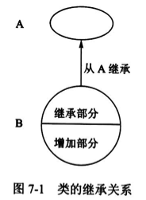

# 面向对象的基本概念

Peter Coad 和 Edward Yourdon 提出用下面的等式识别面向对象方法。

`面向对象 = 对象 (Object) + 分类 (Classification) + 继承 (Inheritance) + 通过消息的通信 (Communication with Messages)`

可以说，采用这 4 个概念开发的软件系统是面向对象的。

## 对象

在面向对象的系统中，对象是基本的运行时的实体，它既包括数据 (属性)，也包括作用于数据的操作 (方法)。一个对象通常可由对象名、属性和方法 3 个部分组成。

在现实世界中，每个实体都是对象，如学生、汽车、电视机和空调等都是现实世界中的对象。每个对象都有它的属性和方法，如电视机有颜色、音量、亮度、灰度、频道等属性，可以有切换频道、增大/减低音量等方法。电视机的属性值表示了电视机所处的状态，而这些属性只能通过其提供的方法来改变。

```typescript
/** 对象: 电视机 */
const television = {
  /** 颜色 */
  color: "black",
  /** 音量 */
  volume: 50,
  /** 亮度 */
  brightness: 10,
  /** 灰度 */
  grayscale: 10,
  /** 频道 */
  channel: 1,
  /** 切换频道 */
  setChannel(value: number) {
    this.channel = value;
  },
  /** 增大音量 */
  addVolume() {
    this.volume++;
  },
  /** 减低音量 */
  reduceVolume() {
    this.volume--;
  },
};
```

## 消息

消息是对象之间进行通信的一种构造。当一个消息发送给某个对象时，包含要求接收对象去执行某些活动的信息。接收到信息的对象经过解释，然后予以响应。这种通信机制称为消息传递。

```typescript
/** 对象: client */
const client = {
  request(server) {
    // 进行通信
    const response = server.response("hello");
    console.log(response);
  },
};

/** 对象: server */
const server = {
  response(message) {
    return "hi";
  },
};

client.request(server);
```

## 类

一个类定义了一组大体上相似的对象。一个类所包含的属性和方法描述一组对象的共同行为和属性。把一组对象的共同特征加以抽象并存储在一个类中是面向对象技术最重要的一点。

抽象之前：

```typescript
/** 对象: people1 */
const people1 = {
  name: "张三",
  age: 18,
  eat() {
    console.log("吃饭...");
  },
};

/** 对象: people2 */
const people2 = {
  name: "李四",
  age: 27,
  eat() {
    console.log("吃饭...");
  },
};
```

抽象之后：

```typescript
/** 类: Person */
class Person {
  name: string;
  age: number;
  constructor(name: string, age: number) {
    this.name = name;
    this.age = age;
  }

  eat() {
    console.log("吃饭...");
  }
}

/** 对象: people1 */
const people1 = new Person("张三", 18);

/** 对象: people2 */
const people2 = new Person("李四", 27);
```

类是在对象之上的抽象，对象是类的具体化，是类的实例 (Instance)。在分析和设计时，通常把注意力集中在类上，而不是具体的对象。也不必逐个定义每个对象，只需对类做出定义，而对类的属性进行不同赋值即可得到该类的对象实例。

类可以分为三种：实体类、接口类 (边界类) 和控制类。

- 实体类的对象表示现实世界中真实的实体，如人、物等。
- 接口类 (边界类) 的对象为用户提供一种与系统合作交互的方式，分为人和系统两大类，其中人的接口可以是显示屏、窗口、Web 窗体、对话框、菜单、列表框、其他显示控制、条形码、二维码或者用户与系统交互的其他方法。系统接口涉及到把数据发送到其他系统，或者从其他系统接收数据。
- 控制类的对象用来控制活动流，充当协调者。

有些类之间存在一般和特殊关系，这是一种 is-a 关系，即特殊类是一种一般类。例如 “汽车” 类、“轮船” 类、“飞机” 类都是一种 “交通工具” 类。特殊类是一般类的子类，一般类是特殊类的父类。同样，“汽车” 类还可以有更特殊的类，如 “轿车” 类、“货车” 类等。在这种关系下形成一种层次的关联。

## 继承

继承是父类和子类之间共享属性和方法的机制。这是类之间的一种关系，在定义和实现一个类的时候，可以在一个已经存在的类的基础上进行，把这个已经存在的类所定义的内容作为自己的内容，并加入若干新的内容。图 7-1 表示了父类 A 和它的子类 B 之间的继承关系。



一个父类可以有多个子类，这些子类都是父类的特例，父类描述了这些子类的公共属性和方法。一个子类可以继承它的父类 (或祖先类) 中的属性和方法，这些属性和操作在子类中不必定义，子类中还可以定义自己的属性和方法。

```typescript
/** 类: Person */
class Person {
  name: string;
  age: number;
  constructor(name: string, age: number) {
    this.name = name;
    this.age = age;
  }

  eat() {
    console.log("吃饭...");
  }
}

/** 类: Teacher */
class Teacher extends Person {
  /** 职级 */
  rank: number;
  constructor(rank: number) {
    super(name, age);
    this.rank = rank;
  }

  teach() {
    console.log("教书...");
  }
}

/** 类: Student */
class Student extends Person {
  /** 年级 */
  grade: number;
  constructor(grade: number) {
    super(name, age);
    this.grade = grade;
  }

  doHomework() {
    console.log("做作业...");
  }
}
```
