# UML

UML (Unified Modeling Language，统一建模语言) 是面向对象软件的标准化建模语言。由于其简单、统一，又能够表达软件设计中的动态和静态信息，目前已经成为可视化建模语言事实上的工业标准。

UML 的词汇表包含 3 种构造块：事物、关系和图。事物是对模型中最具有代表性的成分的抽象；关系把事物结合在一起；图聚集了相关的事物。

## 事物

UML 中有 4 种事物：结构事物、行为事物、分组事物和注释事物。

- 结构事物 (Structural Thing)。结构事物是 UML 模型中的名词。它们通常是模型的静态部分，描述概念或物理元素。

  结构事物包括类 (Class)、接口 (Interface)、协作 (Collaboration)、 用例 (Use Case)、主动类 (Active Class)、构件 (Component)、制品 (Artifact) 和结点 (Node)。各种结构事物的图形化表示如图 7-2 所示。

  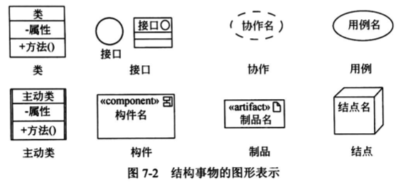

- 行为事物 (Behavior thing)。行为事物是 UML 模型的动态部分。它们是模型中的动词，描述了跨越时间和空间的行为。

  行为事物包括交互 (Interaction)、状态机 (State Machine) 和活动 (Activity)。各种行为事物的图形化表示如图 7-3 所示。

  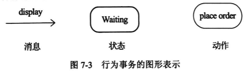

  - 交互由在特定语境中共同完成一定任务的一组对象之间交换的消息组成。一个对象群体的行为或单个操作的行为可以用一个交互来描述。交互涉及一些其他元素，包括消息、动作序列 (由一个消息所引起的行为) 和链 (对象间的连接)。

    在图形上，把一个消息表示为一条有向直线，通常在表示消息的线段上总有操作名。

  - 状态机描述了一个对象或一个交互在生命期内响应事件所经历的状态序列。单个类或一组类之间协作的行为可以用状态机来描述。一个状态机涉及到一些其他元素，包括状态、转换 (从个状态到另一个状态的流)、事件 (触发转换的事物) 和活动 (对一个转换的响应)。

    在图形上，把状态表示为一个圆角矩形，通常在圆角矩形中含有状态的名称及其子状态。

  * 活动是描述计算机过程执行的步骤序列，注重步骤之间的流而不关心哪个对象执行哪个步骤。活动的一个步骤称为一个动作。

    在图形上，把动作画成一个圆角矩形，在其中含有指明其用途的名字。状态和动作靠不同的语境得以区别。

- 分组事物 (Grouping Thing)。分组事物是 UML 模型的组织部分，是一些由模型分解成的 “盒子”。

  在所有的分组事物中，最主要的分组事物是包 (Package)。包是把元素组织成组的机制，这种机制具有多种用途。结构事物、行为事物甚至其他分组事物都可以放进包内。包与构件 (仅在运行时存在) 不同，它纯粹是概念上的 (即它仅在开发时存在)。包的图形化表示如图 7-4 所示。

- 注释事物 (Annotational Thing)。注释事物是 UML 模型的解释部分。这些注释事物用来描述、说明和标注模型的任何元素。

  注解 (Note) 是一种主要的注释事物。注解是一个依附于一个元素或者一组元素之上，对它进行约束或解释的简单符号。注解的图形化表示如图 7-5 所示。

  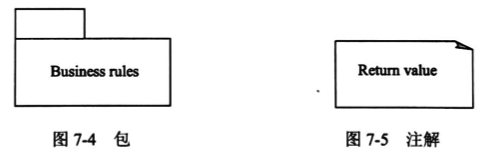

## 关系

UML 中有 4 种关系：依赖、关联、泛化和实现。

- 依赖 (Dependency)。依赖是两个事物间的语义关系，其中一个事物 (独立事物) 发生变化会影响另一个事物 (依赖事物) 的语义。

  在图形上，把一个依赖画成一条可能有方向的虚线，如图 7-6 所示。

- 关联 (Association)。关联是一种结构关系，它描述了一组链，链是对象之间的连接，在关联上可以标注重复度 (Multiplicity) 和角色 (Role)。聚集 (Aggregation) 是一种特殊类型的关联，它描述了整体和部分间的结构关系。

  关联和聚集的图形化表示如图 7-7 和图 7-8 所示。

  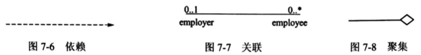

- 泛化 (Generalization)。泛化是一种特殊/一般关系，特殊元素 (子元素) 的对象可替代一般元素 (父元素) 的对象。用这种方法，子元素共享了父元素的结构和行为。

  在图形上，把一个泛化关系画成一条带有空心箭头的实线，它指向父元素，如图 7-9 所示。

- 实现 (Realization)。实现是类元之间的语义关系，其中一个类元指定了由另一个类元保证执行的契约。在两种情况下会使用实现关系：一种是在接口和实现它们的类或构件之间；另一种是在用例和实现它们的协作之间。

  在图形上，把一个实现关系画成一条带有空心箭头的虚线，如图 7-10 所示。

  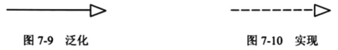

## 图

UML 2.0 提供了 13 种图，分别是类图、对象图、用例图、序列图、通信图、状态图、活动图、构件图、组合结构图、部署图、包图、交互概览图和计时图。

序列图、通信图、交互概览图和计时图均被称为交互图。

### 类图

类图 (Class Diagram) 展现了一组对象、接口、协作和它们之间的关系。在面向对象系统的建模中所建立的最常见的图就是类图，类图给出系统的静态设计视图或静态进程视图。

类图中通常包括以下内容 (如图 7-11 所示)。

- 类、接口、协作。
- 依赖、泛化、关联关系。

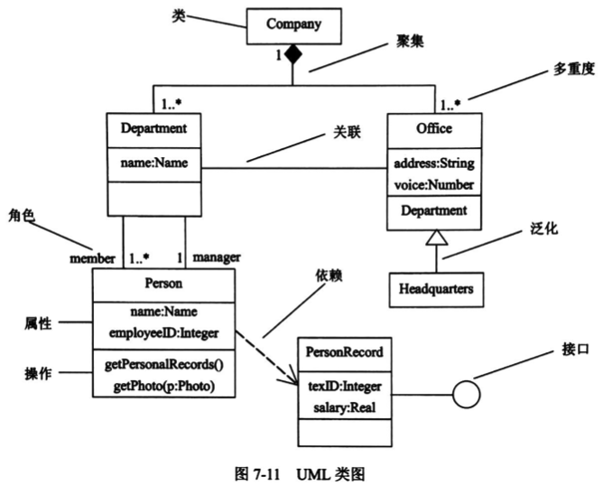

类图用于对系统的静态设计视图建模。这种视图主要支持系统的功能需求，即系统要提供给最终用户的服务。

当对系统的静态设计视图建模时，通常以下述 3 种方式之一使用类图。

- 对系统的词汇建模。涉及：哪些抽象是考虑中的系统的一部分，哪些抽象处于系统边界之外。用类图详细描述这些抽象和它们的职责。
- 对简单的协作建模。协作是一些共同工作的类、接口和其他元素的群体，该群体提供的一些合作行为强于所有这些元素的行为之和。用类图对这组类以及它们之间的关系进行可视化和详述。
- 对逻辑数据库模式建模。将模式看作为数据库的概念设计的蓝图。在很多领域中，要在关系数据库或面向对象数据库中存储永久信息，可以用类图对这些数据库的模式建模。

### 对象图

对象图 (Object Diagram) 展现了某一时刻一组对象以及它们之间的关系，描述了在类图中所建立的事物的实例的静态快照。

对象图一般包括对象和链，如图 7-12 所示。

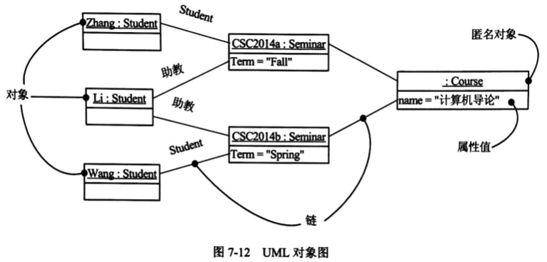

和类图一样，对象图给出系统的静态设计视图或静态进程视图，但它们是从真实的或原型实例的角度建立的。这种视图主要支持系统的功能需求，即系统应该提供给最终用户的服务。利用对象图可以对静态数据结构建模。

### 用例图

用例图 (Use Case Diagram) 展现了一组用例、参与者 (Actor) 以及它们之间的关系。

用例图通常包括以下内容 (如图 7-13 所示)。

- 用例。
- 参与者。
- 用例之间的扩展关系 (`<<extend>>`) 和包含关系 (`<<include>>`)，参与者和用例之间的关联关系，用例与用例以及参与者与参与者之间的泛化关系。

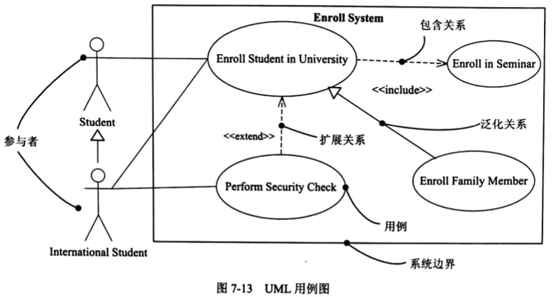

用例图用于对系统的静态用例视图进行建模。这个视图主要支持系统的行为，即该系统在它的周边环境的语境中所提供的外部可见服务。

当对系统的静态用例视图建模时，可以用下列两种方式来使用用例图。

- 对系统的语境建模。对一个系统的语境进行建模，包括围绕整个系统画一条线，并声明有哪些参与者位于系统之外并与系统进行交互。在这里，用例图说明了参与者以及它们所扮演的角色的含义。
- 对系统的需求建模。对一个系统的需求进行建模，包括说明这个系统应该做什么 (从系统外部的一个视点出发)，而不考虑系统应该怎样做。在这里，用例图说明了系统想要的行为。

### 交互图

交互图用于对系统的动态方面进行建模。一张交互图表现的是一个交互，由一组对象和它们之间的关系组成，包含它们之间可能传递的消息。交互图表现为序列图、通信图、交互概览图和计时图。

交互图一般包含对象、链和消息。

**序列图**

序列图 (Sequence Diagram) 是场景 (Scenario) 的图形化表示，描述了以时间顺序组织的对象之间的交互活动。

如图 7-14 所示，形成序列图时，首先把参加交互的对象放在图的上方，沿水平方向排列。通常把发起交互的对象放在左边，下级对象依次放在右边。然后，把这些对象发送和接收的消息沿垂直方向按时间顺序从上到下放置。这样，就提供了控制流随时间推移的清晰的可视化轨迹。

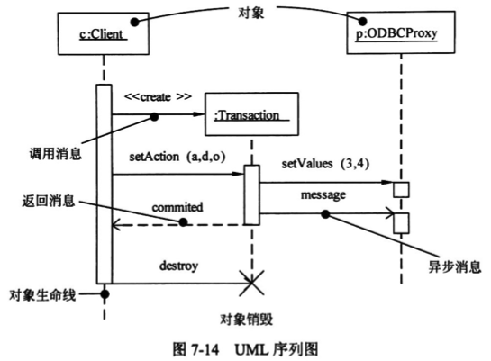

序列图有两个不同于通信图的特征。

- 序列图有对象生命线。对象生命线是一条垂直的虚线，表示一个对象在一段时间内存在。在交互图中出现的大多数对象存在于整个交互过程中，所以这些对象全都排列在图的顶部，其生命线从图的顶部画到图的底部。
- 序列图有控制焦点。控制焦点是一个瘦高的矩形，表示一个对象执行一个动作所经历的时间段，既可以是直接执行，也可以是通过下级过程执行。矩形的顶部表示动作的开始，底部表示动作的结束 (可以由一个返回消息来标记)。

**通信图**

通信图 (Communication Diagram) 强调收发消息的对象的结构组织，在早期的版本中也被称作协作图。通信图强调参加交互的对象的组织。

如图 7-15 所示，形成通信图时，首先要将参加交互的对象作为图的顶点，然后把连接这些对象的链表示为图的弧，最后用对象发送和接收的消息来修饰这些链。这就提供了在协作对象的结构组织的语境中观察控制流的一个清晰的可视化轨迹。

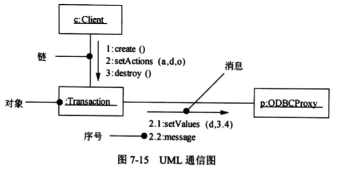

通信图有两个不同于序列图的特性。

- 通信图有路径。为了指出一个对象如何与另一个对象链接，可以在链的末端附上一个路径构造型 (如构造型 `<<local>>`，表示指定对象对发送者而言是局部的)。通常只需要显式地表示以下几种链的路径：local (局部)、parameter (参数)、global (全局) 以及 self (自身)。
- 通信图有顺序号。为表示一个消息的时间顺序，可以给消息加一个数字前级 (从 1 号消息开始)，在控制流中，每个新消息的顺序号单调增加 (如 2、3 等)。为了显示嵌套，可使用带小数点的号码 (1 表示第一个消息；1.1 表示嵌套在消息 1 中的第一个消息，1.2 表示嵌套在消息 1 中的第二个消息，等等)。嵌套可为任意深度。还要注意的是，沿同一个链可以显示许多消息 (可能发自不同的方向)，并且每个消息都有唯一的一个顺序号。

**交互概览图**

交互概览图 (Interaction Overview Diagram) 是 UML 2.0 新增的交互图之一，它是活动图的变体，描述业务过程中的控制流概览，软件过程中的详细逻辑概览，以及将多个图进行连接，抽象掉了消息和生命线。

交互概览图使用活动图的表示法，如图 7-16 所示。纯粹的交互概览图中所有的活动都是交互发生。

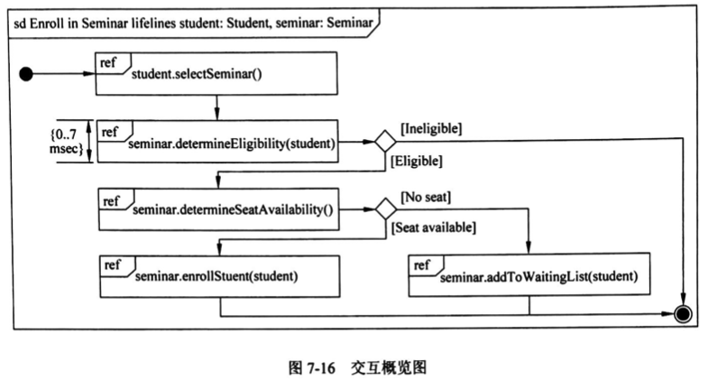

**计时图**

计时图 (Timing Diagram) 是另一种新增的、特别适合实时和嵌入式系统建模的交互图，关注沿着线性时间轴、生命线内部和生命线之间的条件改变。

计时图描述对象状态随着时间改变的情况，很像示波器，如图 7-17 所示，适合分析周期和非周期性任务。

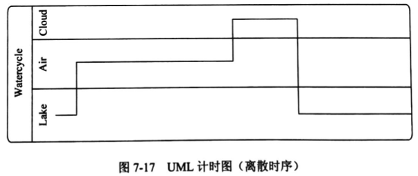

### 状态图

状态图 (State Diagram) 展现了一个状态机，它由状态、转换、事件和活动组成。

状态图关注系统的动态视图，对于接口、类和协作的行为建模尤为重要，强调对象行为的事件顺序。

状态图通常包括简单状态和组合状态、转换 (事件和动作)，如图 7-18 所示。

状态是指对象的生命周期中某个条件或者状态，当某个事件发生后，对象的状态将发生变化。嵌套在另外一个状态中的状态称为子状态，含有子状态的状态称为组合状态。转换是两个状态之间的一种关系，表示对象将在源状态中执行一定的动作，并在某个特定事件发生而且某个特定的警界 (监护) 条件满足时进入目标状态。动作是一个可执行的原子操作，是不可中断的，其执行时间是可忽略不计的。

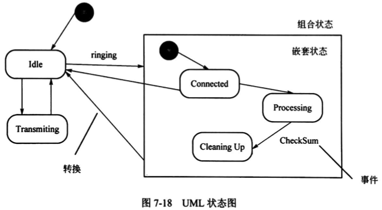

可以用状态图对系统的动态方面建模。这些动态方面可以包括出现在系统体系结构的任何视图中的任何一种对象的按事件排序的行为，这些对象包括类 (各主动类)、接口、构件和结点。

### 活动图

活动图 (Activity Diagram) 是一种特殊的状态图，它展现了在系统内从一个活动到另一个活动的流程，如图 7-19 所示。活动图专注于系统的动态视图，它对于系统的功能建模特别重要，并强调对象间的控制流程。

活动图一般包括活动状态和动作状态、转换和对象。

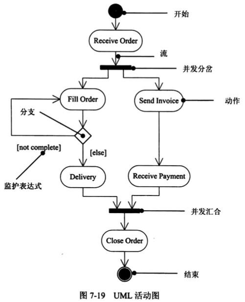

活动图可以表示分支、合并、分岔和汇合。

- 分支描述基于布尔表达式的可选择路径，可有个入流和两个或多个出流，在每个出流上放置一个布尔表达式条件，每个出流的条件不应该重叠，但需要覆盖所有可能性。
- 合并描述当两条控制路径重新合并时，不需要监护条件，只有一个出流。
- 分岔描述把一个控制流分成两个或多个并发控制流，可以有一个进入转移和两个或多个离去转移，每个离去的转移表示一个独立的控制流，这些流可以并行的进行。
- 汇合表示两个或多个并发控制流的同步，可以有两个或多个进入转移和一个离去转移，意味着每个进入流都等待，直到所有进入流都达到这个汇合处。

当对一个系统的动态方面建模时，通常有两种使用活动图的方式。

- 对工作流建模。此时所关注的是与系统进行协作的参与者所观察到的活动。工作流常常位于软件系统的边缘，用于可视化、详述、构造和文档化开发系统所涉及的业务过程。在活动图的这种用法中，对对象流的建模是特别重要的，常采用泳道将活动图中的活动状态分组。
- 对操作建模。此时是把活动图作为流程图使用，对一个计算的细节部分建模。在活动图的这种用法中，对分支、合并、分岔和汇合状态的建模是特别重要的。用于这种方式的活动图语境包括该操作的参数和它的局部对象。

### 构建图

构件图 (Component Diagram) 展现了一组构件之间的组织和依赖。构件图专注于系统的静态实现视图，如图 7-20 所示。它与类图相关，通常把构件映射为一个或多个类、接口或协作。

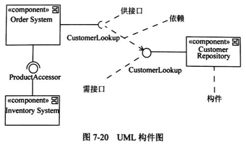

### 组合结构图

组合结构图 (Composite Structure Diagram) 用于描述一个分类器 (如类、构件或用例) 的内部结构，分类器与系统中其他组成部分之间的交互端口，展示一组相互协作的实例如何完成特定的任务，描述设计、架构模式或策略。

组合结构图的内部结构和协作使用图分别如图 7-21 和图 7-22 所示。

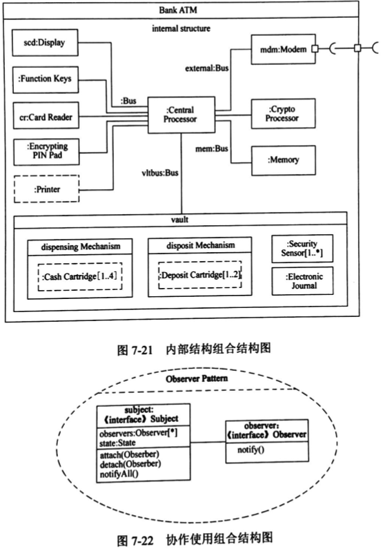

### 部署图

部署图 (Deployment Diagram) 是用来对面向对象系统的物理方面建模的方法，展现了运行时处理结点以及其中制品的配置。

部署图对系统的静态部署视图进行建模。通常，一个结点是一个在运行时存在并代表一项计算资源的物理元素，至少拥有一些内容，常常具有处理能力，包含一个或多个构件。

部署图通常包括制品、结点，如图 7-23 所示，其中，`<<artifact>>` 表示制品。

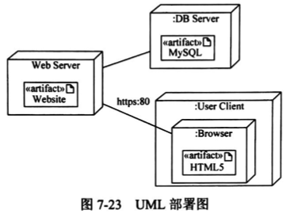

### 包图

包图 (Package Diagram) 是用于把模型本身组织成层次结构的通用机制，不能执行，展现由模型本身分解而成的组织单元以及组织单元间的依赖关系。

包可以拥有其他元素，可以是类、接口、构件、结点、协作、用例和图，甚至是嵌套的其他包，如图 7-24 所示。

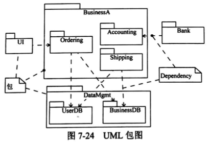
