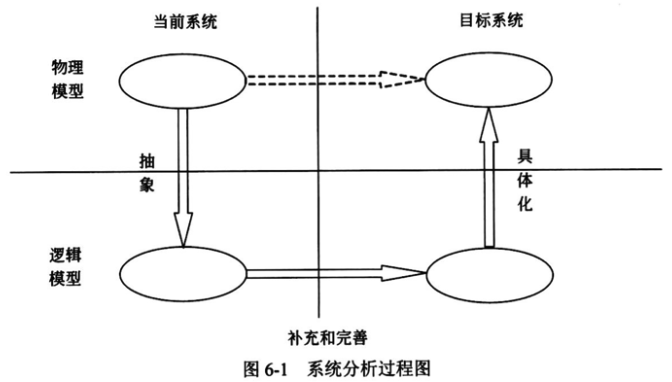
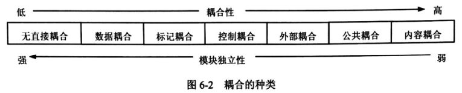
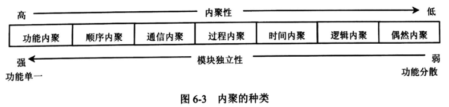
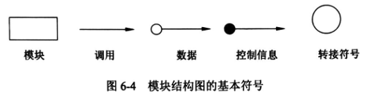
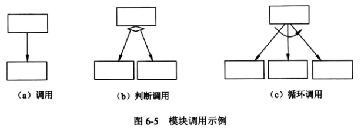
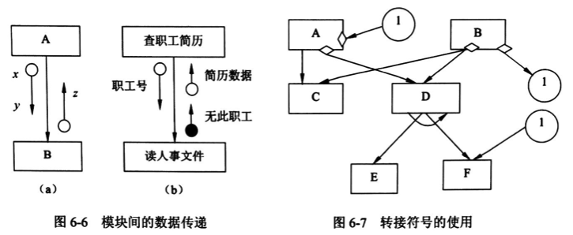

# 系统分析与设计

## 系统分析概述

系统分析是一种问题求解技术，它将一个系统分解成各个组成部分，目的是研究各个部分如何工作、交互，以实现其系统目标。

系统分析的目的是为项目团队提供对触发项目的问题和需求的更全面的理解，因此强调业务问题方面，而非技术或实现方面。系统分析阶段要求和系统用户一起工作，以便清楚地定义新系统的业务需求和预期。

### 系统分析的目的和任务

系统分析的主要任务是对现行系统进一步详细调查，将调查中所得到的文档资料集中，对组织内部整体管理状况和信息处理过程进行分析，主要目的是为系统开发提供所需的资料，并提交系统方案说明书。

系统分析侧重于从业务全过程的角度进行分析，主要内容有：业务和数据的流程是否通畅、是否合理；数据、业务过程和组织管理之间的关系；原系统管理模式改革和新系统管理方法的实现是否具有可行性等。

确定的分析结果包括：开发者对于现有组织管理状况的了解，用户对信息系统功能的需求，数据和业务流程，管理功能和管理数据指标体系以及新系统拟改动和新增的管理模型等。

最后，提出信息系统的各种设想和方案，并对所有的设想和方案进行分析、研究、比较、判断和选择，获得一个最优的新系统的逻辑模型，并在用户理解计算机系统的工作流程和处理方式的情况下，将它明确地表达成书面资料——系统分析报告，即系统方案说明书。

### 系统分析的主要步骤

系统分析过程一般按如图 6-1 所示的逻辑进行。

(1) 认识、理解当前的现实环境，获得当前系统的 “物理模型”。

(2) 从当前系统的 “物理模型” 抽象出当前系统的 “逻辑模型”。

(3) 对当前系统的 “逻辑模型” 进行分析和优化，建立目标系统的 “逻辑模型”。

(4) 对目标系统的逻辑模型具体化 (物理化)，建立目标系统的物理模型。

系统开发的目的是把现有系统的物理模型转化为目标系统的物理模型，即图 6-1 中双虚线所描述的路径，而系统分析阶段的结果是得到目标系统的逻辑模型。逻辑模型反映了系统的功能和性质，而物理模型反映的是系统的某一种具体实现方案。

按照图 6-1，可将系统分析阶段的主要工作分为以下几步。

(1) 对当前系统进行详细调查，收集数据。

(2) 建立当前系统的逻辑模型。

(3) 对现状进行分析，提出改进意见和新系统应达到的目标。

(4) 建立新系统的逻辑模型。

(5) 编写系统方案说明书。

## 系统设计的基本原理

### 抽象

抽象是一种设计技术，重点说明一个实体重要的方面，而忽略不太重要的方面。在系统中，一个实体重要和不重要的方面可以根据系统的业务需求来划分。

### 模块化

模块化是指将一个待开发的软件分解成若干个小的简单部分——模块，每个模块可独立地开发、测试，最后组装成完整的程序。这是一种复杂问题 “分而治之” 的原则。

模块化的目的是使程序的结构清晰，容易阅读、理解、测试和修改。

### 信息隐蔽

信息隐蔽是开发整体程序结构时使用的法则，即将每个程序的成分隐蔽或封装在一个单一的设计模块中，在定义每一个模块时尽可能少地显露其内部的处理。

在设计时首先列出一些可能发生变化的因素，在划分模块时将一个可能发生变化的因素隐蔽在某个模块的内部，使其他模块与这个因素无关。当这个因素发生变化时，只需修改含有这个因素的模块，而与其他模块无关。

信息隐蔽原则对提高软件的可修改性、可测试性和可移植性都有重要的作用。

### 模块独立

模块独立是指每个模块完成一个相对独立的特定子功能，并且与其他模块之间的联系简单。

衡量模块独立程度的标准有两个：耦合性和内聚性。

#### 耦合

耦合是模块之间的相对独立性 (互相连接的紧密程度) 的度量。耦合取决于各个模块之间接口的复杂程度、调用模块的方式以及通过接口的信息类型等。一般模块之间可能的耦合方式有 7 种类型，如图 6-2 所示。

- 无直接耦合。指两个模块之间没有直接的关系，它们分别从属于不同模块的控制与调用，它们之间不传递任何信息。因此，模块间耦合性最弱，模块独立性最高。
- 数据耦合。指两个模块之间有调用关系，传递的是简单的数据值，相当于高级语言中的值传递。
- 标记耦合。指两个模块之间传递的是数据结构。
- 控制耦合。指一个模块调用另一个模块时，传递的是控制变量，被调用模块通过该控制变量的值有选择地执行模块内的某一功能。因此，被调用模块应具有多个功能，哪个功能起作用受调用模块控制。
- 外部耦合。模块间通过软件之外的环境联结 (如 I/O 将模块耦合到特定的设备、格式、通信协议上) 时称为外部耦合。
- 公共耦合。指通过一个公共数据环境相互作用的那些模块间的耦合。
- 内容耦合。当一个模块直接使用另一个模块的内部数据，或通过非正常入口转入另一个模块内部时，这种模块之间的耦合称为内容耦合。

#### 内聚

内聚是对一个模块内部各个元素彼此结合的紧密程度的度量。一个内聚程度高的模块 (在理想情况下) 应当只做一件事。一般模块的内聚性分为 7 种类型，如图 6-3 所示。

- 偶然内聚 (巧合内聚)。指一个模块内的各处理元素之间没有任何联系。
- 逻辑内聚。指模块内执行若干个逻辑上相似的功能，通过参数确定该模块完成哪一个功能。
- 时间内聚。把需要同时执行的动作组合在一起形成的模块称为时间内聚模块。
- 过程内聚。指一个模块完成多个任务，这些任务必须按指定的过程执行。
- 通信内聚。指模块内的所有处理元素都在同一个数据结构上操作，或者各处理使用相同的输入数据或者产生相同的输出数据。
- 顺序内聚。指一个模块中的各个处理元素都密切相关于同一功能且必须顺序执行，前一功能元素的输出就是下一功能元素的输入。
- 功能内聚。这是最强的内聚，指模块内的所有元素共同作用完成一个功能，缺一不可。

耦合性和内聚性是模块独立性的两个定性标准，在将软件系统划分模块时，应尽量做到高内聚、低耦合，提高模块的独立性。

## 系统总体结构设计

系统总体结构设计是要根据系统分析的要求和组织的实际情况对新系统的总体结构形式和可利用的资源进行大致设计，这是一种宏观、总体上的设计和规划。

### 系统结构设计原则

为保证总体结构设计顺利完成，应遵循以下几条原则。

(1) 分解-协调原则。整个系统是一个整体，具有整体目的和功能，但这些目的和功能的实现又是由相互联系的各个组成部分共同工作的结果。解决复杂问题的一个很重要的原则就是把它分解成多个小问题分别处理，在处理过程中根据系统总体要求协调各部门的关系。

(2) 自顶向下的原则。首先抓住系统总的功能目的，然后逐层分解，即先确定上层模块的功能，再确定下层模块的功能。

(3) 信息隐蔽、抽象的原则。上层模块只规定下层模块做什么和所属模块间的协调关系，但不规定怎么做，以保证各模块的相对独立性和内部结构的合理性，使得模块与模块之间层次分明，易于理解、实施和维护。

(4) 一致性原则。要保证整个软件设计过程中具有统一的规范、统一的标准和统一的文件模式等。

(5) 明确性原则。每个模块必须功能明确、接口明确，消除多重功能和无用接口。

(6) 模块之间的耦合尽可能小，模块的内聚度尽可能高。

(7) 模块的扇入系数和扇出系数要合理。一个模块直接调用其他模块的个数称为模块的扇出系数；反之，一个模块被其他模块调用时，直接调用它的模块个数称为模块的扇入系数。模块的扇入、扇出系数必须适当。经验表明，一个设计得好的系统的平均扇入、扇出系数通常是 3 或 4，一般不应超过 7，否则会引起出错概率的增大。但菜单调用型模块的扇入与扇出系数可以大一些，公用模块的扇入系数可以大一些。

(8) 模块的规模适当。过大的模块常常使系统分解得不充分，其内部可能包含了若干部分的功能，因此有必要进一步把原有的模块分解成若干功能尽可能单一的模块。但分解也必须适度，因为过小的模块有可能降低模块的独立性，造成系统接口的复杂性。

### 子系统划分

#### 子系统划分的原则

为了便于今后的系统开发和系统运行，子系统的划分应遵循以下几点原则。

(1) 子系统要具有相对独立性。子系统的划分，必须使得子系统的内部功能、信息等各方面的凝聚性较好。子系统独立可以减少子系统间的相互影响，有利于多人分工开发不同的模块，从而提高软件产品的生产率，保证软件产品的质量，同时也增强了系统的可维护性和适应性。

(2) 子系统之间数据的依赖性尽量小。子系统之间的联系要尽量减少，接口要简单明确。一个内部联系强的子系统对外部的联系必然很少，所以在划分的时候，应将联系较多者列入子系统内部，而剩余的一些分散、跨度比较大的联系，就成为这些子系统间的联系和接口。这样划分的子系统，将来调试、维护和运行都是非常方便的。

(3) 子系统划分的结果应使数据冗余较小。如果把相关的功能数据分布到各个不同的子系统中，则会有大量的原始数据需要调用，大量的中间结果需要保存和传递，大量的计算工作将要重复进行，从而使得程序结构素乱，数据冗余，不仅给编码带来很大的困难，而且系统的工作效率也大大降低。

(4) 子系统的设置应考虑今后管理发展的需要。子系统的设置仅依靠上述系统分析的结构是不够的，因为现存的系统由于各种原因，很可能没有考虑到一些高层次管理决策的要求。

(5) 子系统的划分应便于系统分阶段实现。信息系统的开发是一项较大的工程，它的实现般要分批进行，所以子系统的划分应能适应这种分期分批的实施。另外，子系统的划分还必须兼顾组织结构的要求。

(6) 子系统的划分应考虑到各类资源的充分利用。一个适当的子系统划分应该既考虑有利于各种设备资源在开发过程中的搭配使用，又考虑到各类信息资源的合理分布和充分使用，以减少系统对网络资源的过分依赖，减少输入、输出和通信等设备压力。

#### 子系统结构设计

子系统结构设计的任务是确定划分后的子系统模块结构，并画出模块结构图。在这个过程中必须考虑以下几个问题。

(1) 每个子系统如何划分成多个模块。

(2) 如何确定子系统之间、模块之间传送的数据及其调用关系。

(3) 如何评价并改进模块结构的质量。

(4) 如何从数据流图导出模块结构图。

### 系统模块结构设计

#### 模块的概念

模块是组成系统的基本单位，它的特点是可以组合、分解和更换。系统中的任何一个处理功能都可以看成是一个模块。

根据功能具体化程度的不同，模块可以分为逻辑模块和物理模块。在系统逻辑模型中定义的处理功能可视为逻辑模块。物理模块是逻辑模块的具体化，可以是一个计算机程序、子程序或若干条程序语句，也可以是人工过程的某项具体工作。

一个模块应具备以下 4 个要素。

(1) 输入和输出。模块的输入来源和输出去向都是同一个调用者，即一个模块从调用者那里取得输入，进行加工后再把输出返回给调用者。

(2) 处理功能。指模块把输入转换成输出所做的工作。

(3) 内部数据。指仅供该模块本身引用的数据。

(4) 程序代码。指用来实现模块功能的程序。

前两个要素是模块外部特性，反映了模块的外貌。后两个要素是模块的内部特性。在结构化设计中，主要考虑的是模块的外部特性，对其内部特性只做必要了解，具体的实现将在系统实施阶段完成。

#### 模块结构图

为了保证系统设计工作的顺利进行，结构设计应遵循以下原则。

(1) 所划分的模块其内部的凝聚性要强，模块之间的联系要少，即模块具有较强的独立性。

(2) 模块之间的连接只能存在上下级之间的调用关系，不能有同级之间的横向联系。

(3) 整个系统呈树状结构，不允许网状结构或交叉调用关系出现。

(4) 所有模块都必须严格地分类编码并建立归档文件。

模块结构图主要关心的是模块的外部属性，即上下级模块、同级模块之间的数据传递和调用关系，并不关心模块的内部。

模块结构图是结构化设计中描述系统结构的图形工具。作为一种文档，它必须严格地定义模块的名字、功能和接口，同时还应当在模块结构图上反映出结构化设计的思想。模块结构图由模块、调用、数据、控制信息和转接符号 5 种基本符号组成，如图 6-4 所示，说明如下。

- 模块。这里所说的模块通常是指用一个名字就可以调用的一段程序语句。在长方形中间标上能反映模块处理功能的模块名字。
- 调用。箭头总是由调用模块指向被调用模块，但是应该理解被调用模块执行后又返回到调用模块。

如果一个模块是否调用一个从属模块，取决于调用模块内部的判断条件，则该调用模块间的判断调用采用菱形符号表示。如果一个模块通过其内部的循环功能来循环调用一个或多个从属模块，则该调用称为循环调用，用弧形箭头表示。判断调用和循环调用的表示方法如图 6-5 所示。

- 数据。当一个模块调用另一个模块时，调用模块可以把数据传送到被调用模块供处理，而被调用模块又可以将处理的结构送回到被调用模块。在模块之间传送的数据，使用与调用箭头平行的带空心圆的箭头表示，并在旁边标上数据名。图 6-6 (a) 表示模块 A 调用模块 B 时，A 将数据 x、y 传送给 B，B 将处理结果数据 z 返回给 A。
- 控制信息。在模块间有时必须传送某些控制信息。例如，数据输入完成后给出的结束标志，文件读到末尾时所产生的文件结束标志等。控制信息与数据的主要区别是前者只反映数据的某种状态，不必进行处理。图 6-6 (b) 中的 “无此职工” 就是用来表示送来的职工号有误的控制信息。
- 转接符号。当模块结构图在一张纸上画不下，需要转接到另一张纸上，或者为了避免图上线条交叉时，都可以使用转接符号，圆圈内加上标号，如图 6-7 所示。

### 数据存储设计

信息系统的主要任务是从大量的数据中获得管理所需要的信息，这就必须存储和管理大量的数据。因此，建立一个良好的数据组织结构和数据库，使整个系统都可以迅速、方便、准确地调用和管理所需的数据，是衡量信息系统开发工作好坏的主要指标之一。

数据结构组织和数据库或文件设计，就是要根据数据的不同用途、使用要求、统计渠道和安全保密性等来决定数据的整体组织形式、表或文件的形式，以及决定数据的结构、类别、载体、组织方式、保密级别等一系列的问题。

一个好的数据结构和数据库应该充分满足组织的各级管理要求，同时还应该使后继系统的开发工作方便、快捷、系统开销 (如占用空间、网络传输频度、磁盘或光盘读写次数等) 小、易于管理和维护。

## 系统文档

信息系统的文档是系统建设过程的 “痕迹”，是系统维护人员的指南，是开发人员与用户交流的工具。规范的文档意味着系统是按照工程化开发的，意味着信息系统的质量有了形式上的保障。文档的欠缺、文档的随意性和文档的不规范，极有可能导致原来的开发人员流动以后，系统不可维护、不可升级，变成了一个没有扩展性、没有生命力的系统。

信息系统的文档不仅包括应用软件开发过程中产生的文档，还包括硬件采购和网络设计中形成的文档；不仅包括上述有一定格式要求的规范文档，也包括系统建设过程中的各种来往文件、会议纪要、会计单据等资料形成的不规范文档，后者是建设各方谈判甚至索赔的重要依据；不仅包括系统实施记录，也包括程序资料和培训教程等。

对文档在系统开发人员、项目管理人员、系统维护人员、系统评价人员以及用户之间的多种作用总结如下。

(1) 用户与系统分析人员在系统规划和系统分析阶段通过文档进行沟通。这里的文档主要包括可行性研究报告、总体规划报告、系统开发合同和系统方案说明书等。有了文档，用户就能依次对系统分析师是否正确理解了系统的需求进行评价，如不正确，可以在已有文档的基础上进行修正。

(2) 系统开发人员与项目管理人员通过文档在项目期内进行沟通。这里的文档主要有系统开发计划 (包括工作任务分解表、PERT 图、甘特图和预算分配表等)、系统开发月报以及系统开发总结报告等项目管理文件。有了这些文档，不同阶段之间的开发人员就可以进行工作的顺利交接，同时还能降低因为人员流动带来的风险，因为接替人员可以根据文档理解前面人员的设计思路或开发思路。

(3) 系统测试人员与系统开发人员通过文档进行沟通。系统测试人员可以根据系统方案说明书、系统开发合同、系统设计说明书和测试计划等文档对系统开发人员所开发的系统进行测试。系统测试人员再将评估结果撰写成系统测试报告。

(4) 系统开发人员与用户在系统运行期间进行沟通。用户通过系统开发人员撰写的文档运行系统。这里的文档主要是用户手册和操作指南。

(5) 系统开发人员与系统维护人员通过文档进行沟通。这里的文档主要有系统设计说明书和系统开发总结报告。有的开发总结报告写得很详细，分为研制报告、技术报告和技术手册 3 个文档，其中的技术手册记录了系统开发过程中的各种主要技术细节。这样，即使系统维护人员不是原来的开发人员，也可以在这些文档的基础上进行系统的维护与升级。

(6) 用户与维修人员在运行维护期间进行沟通。用户在使用信息系统的过程中，将运行过程中的问题进行记载，形成系统运行报告和维护修改建议。系统维护人员根据维护修改建议以及系统开发人员留下的技术手册等文档对系统进行维护和升级。
